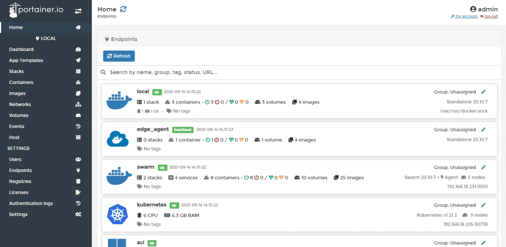
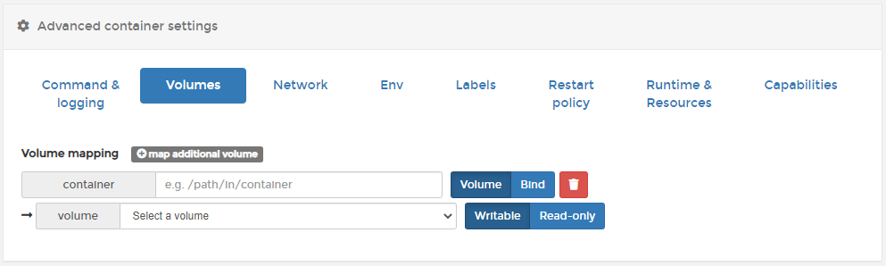
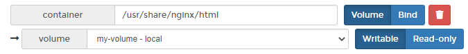
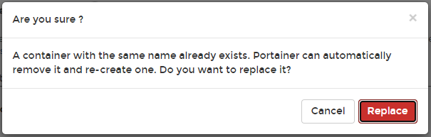

# Attach a volume to a container


This article explains how to attach a new [volume](../volumes/) to a running container. This operation destroys the running container and starts a new one with the volume attached.

**Always back up your data before running this operation.**


From the menu select **Containers** then select the container that you want to attach a volume to, then click **Duplicate/Edit**.

Scroll down to **Advanced container settings**. Click **Volumes** then click **map additional volume**.

In the **container** field enter the path. In the **volume** field enter the volume to attach to the container.

When you're ready, click **Deploy the container**. When the confirmation message appears, click **Replace**.

