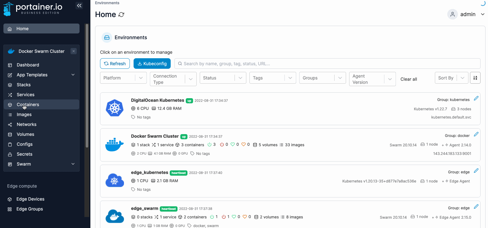
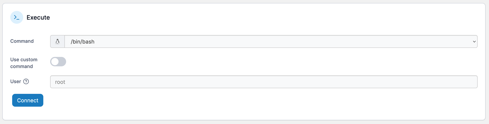
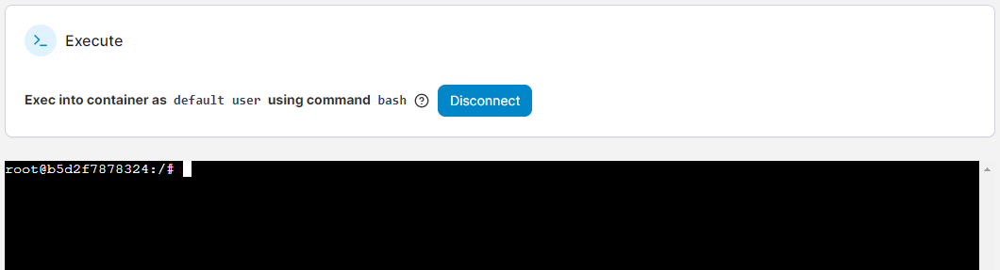

# Access a container's console

From the menu select **Containers**, select the container then select **Console**.

<figure><figcaption></figcaption></figure>

Select the command and the user you want to give access to, then click **Connect**.


For Alpine Linux containers, you must select the`/bin/ash` command.


<figure><figcaption></figcaption></figure>

If you need to define a command other than those provided, toggle the **Use custom command** option on. Once connected, you can run commands in the console the same as any other Linux system.

<figure><figcaption></figcaption></figure>

To disconnect from the console session, click the **Disconnect** button.
