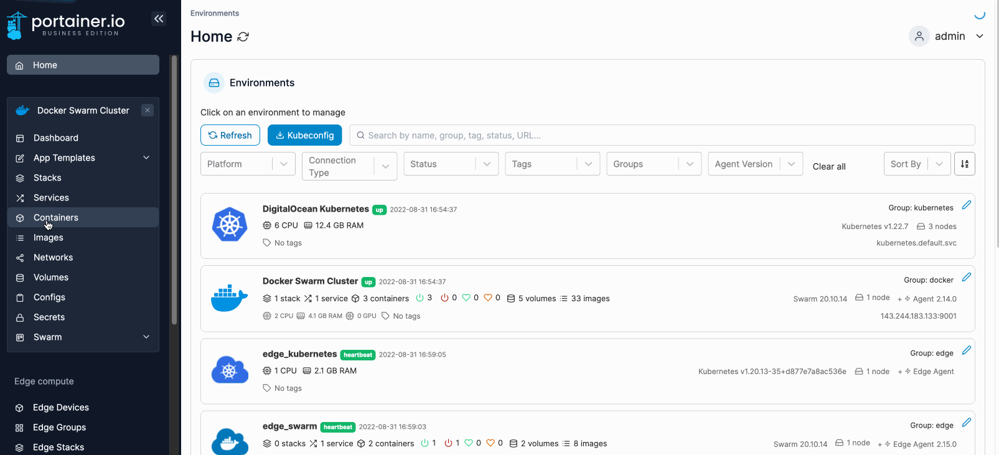
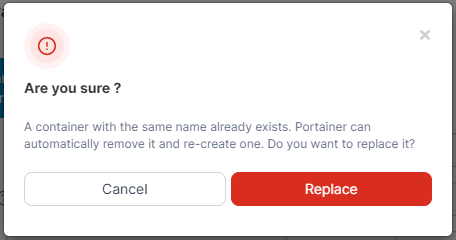

# Edit or duplicate a container


Editing a container effectively creates a new container with the updated settings and replaces the old container.


## Editing a running container

From the menu select **Containers**, select the container you want to edit then click **Duplicate/Edit**.

<figure><figcaption></figcaption></figure>

Make the required changes to the container configuration. When you're finished, click **Deploy the container**. When the confirmation message appears, click **Replace**.

<figure><figcaption></figcaption></figure>

If successful, a message will appear confirming that a new container has been created with the new settings, replacing the old container.

## Duplicating a running container

From the menu select **Containers**, select the container you want to duplicate then click **Duplicate/Edit**.

<figure><figcaption></figcaption></figure>

Make the required changes to the container configuration, making sure you enter a new container name in order to create a duplicate. When you're finished, click **Deploy the container**.

