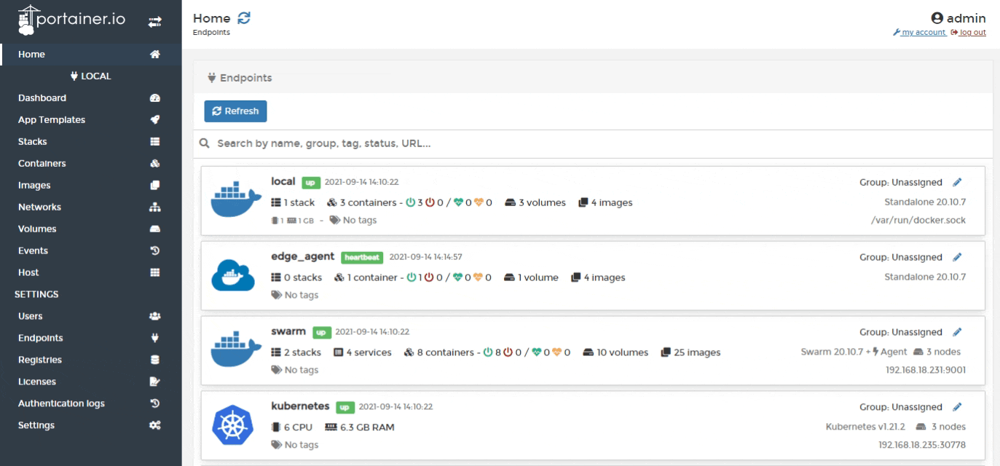
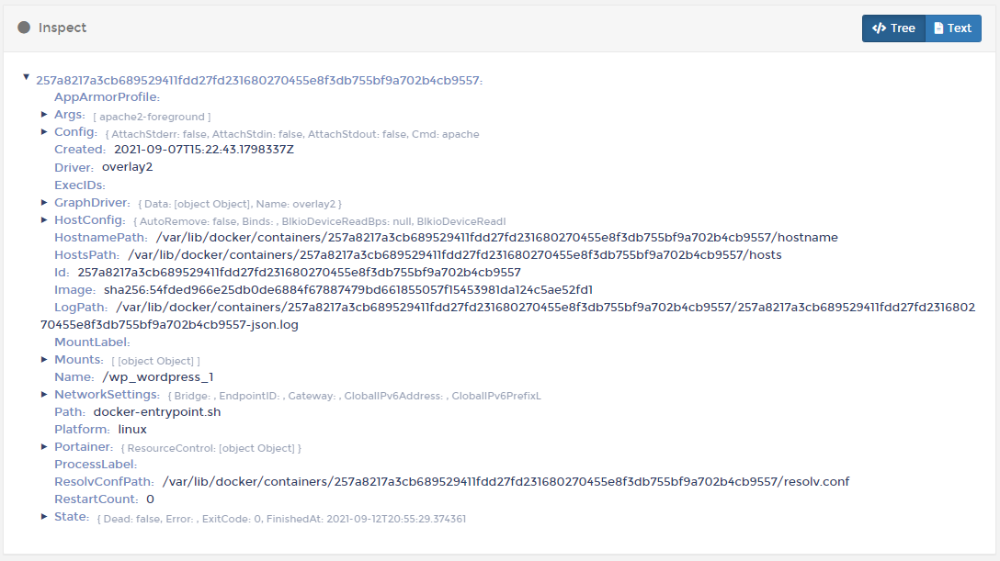
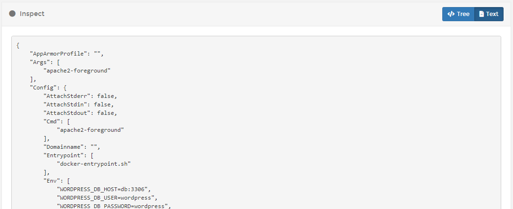

# Inspect a container

View information about any container, such as network settings, volumes and images.

From the menu select **Containers**, select the container then select **Inspect**.

All of the information about the container will display in tree view. Select any parameter to show more details \(if available\).

You can also inspect the container in a raw JSON text format by clicking **Text**.

