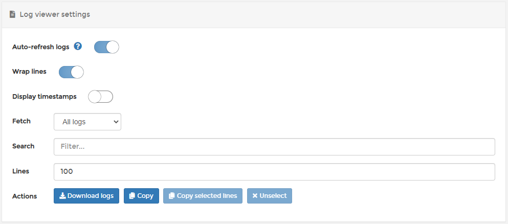

# View container logs

From the menu select **Containers**, select the container then select **Logs**.

The following options are available in the log viewer:

| Field/Option       | Overview                                                                                          |
| ------------------ | ------------------------------------------------------------------------------------------------- |
| Auto-refresh logs  | Toggle this option off to pause the logging process and auto-scrolling.                           |
| Wrap lines         | Makes it easier to read long lines of information.                                                |
| Display timestamps | Useful when you need to know when log entries were generated.                                     |
| Fetch              | Lets you change the logging frequency.                                                            |
| Search             | Search for specific keywords found in the log file.                                               |
| Lines              | Limit the number of lines per log file (the default is 100).                                      |
| Actions            | These options let you download the logs, copy all lines or selected lines, or unselect all lines. |

