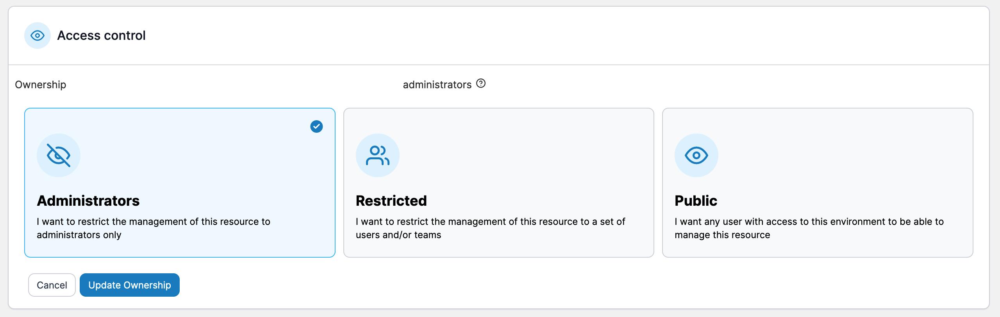
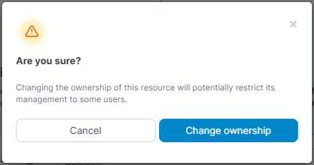

# Change container ownership

Portainer allows you to limit container management to specific teams or users.

From the menu select **Containers** then select the container whose ownership you want to change.

<figure><figcaption></figcaption></figure>

Under the **Access control** section tick the **Change ownership** checkbox then select the new ownership type, using the table below as a guide.

| Ownership Type | Overview                                                                                                    |
| -------------- | ----------------------------------------------------------------------------------------------------------- |
| Administrators | Only Portainer administrators can manage the container.                                                     |
| Restricted     | Only teams or users you specify can manage the container.                                                   |
| Public         | Anyone who has [access to the environment](../../../admin/environments/access.md) can manage the container. |

<figure><figcaption></figcaption></figure>

When you've made your selection, click **Update ownership**. When the confirmation message appears, click **Change ownership**.

<figure><figcaption></figcaption></figure>
