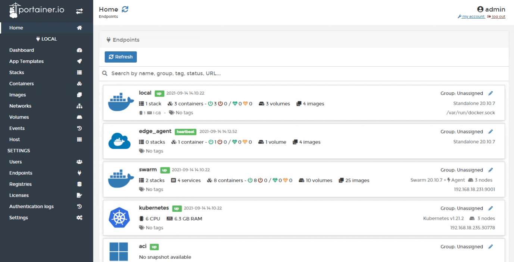
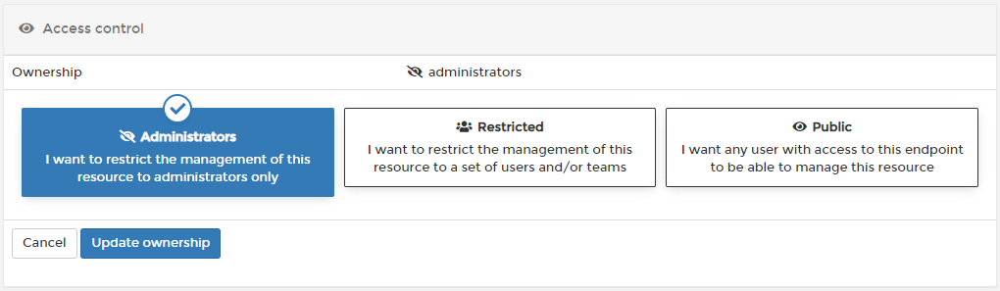

# Change container ownership

Limit container management to specific teams or users.

From the menu select **Containers** then select the container whose ownership you want to change.

Under the **Access control** section tick the **Change ownership** checkbox then select the new ownership type, using the table below as a guide.

| Ownership Type | Overview |
| :--- | :--- |
| Administrators | Only Portainer administrators can manage the container. |
| Restricted | Only teams or users you specify can manage the container. |
| Public | Anyone who has [access to the endpoint](../../../admin/endpoints/access.md) can manage the container. |

When you've made your selection, click **Update ownership**. When the confirmation message appears, click **Change ownership**.

