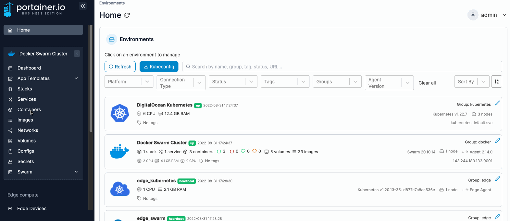
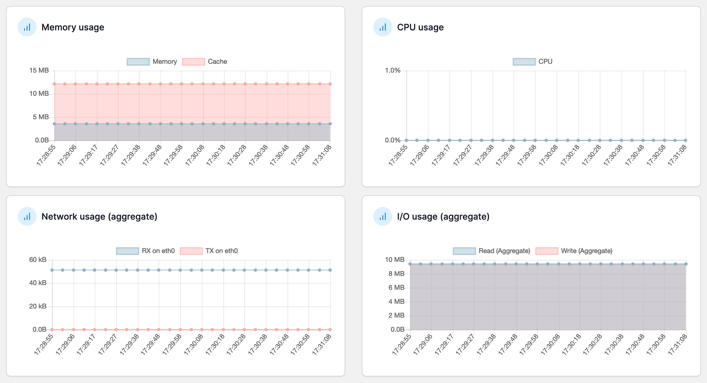
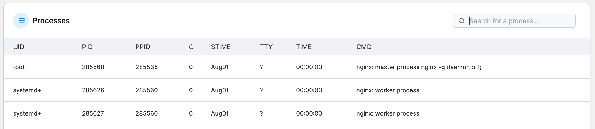

# View container statistics

From the menu select **Containers**, select the container then select **Stats**.

<figure><figcaption></figcaption></figure>

The information available includes:

* Memory usage.
* CPU usage.
* Network usage (RX and TX).
* I/O usage.
* Processes running in the container

<figure><figcaption></figcaption></figure>

<figure><figcaption></figcaption></figure>


You can change the refresh rate at any time.

