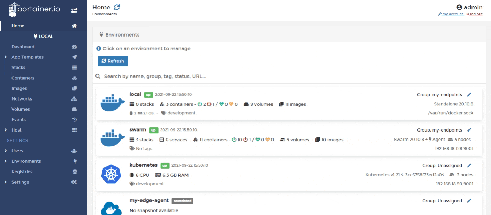
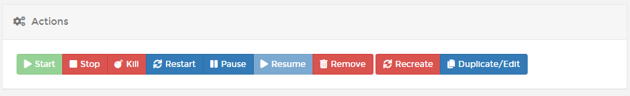
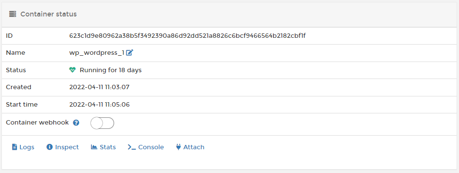

# View a container's details

From the menu select **Containers**, then select the container you want to view.

Here you can view the container's status and details, including port configurations, environment variables, labels, attached volumes and networks, and more. You also have a number of actions available, including starting, stopping and removing the container.

You can also toggle the container [webhook](webhooks.md), view the [container logs](logs.md), [inspect](inspect.md) the container's configuration, view container [stats](stats.md), access the [console](console.md), and (if the container is running in interactive mode) attach to the running container.

You can create an image from a deployed container to use when creating other containers.

