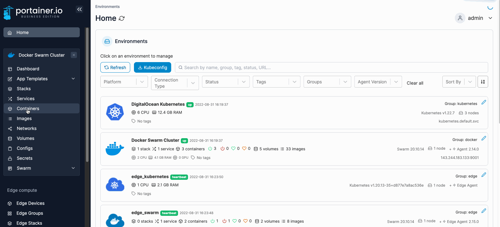
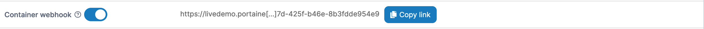

# Webhooks

A webhook is a POST request sent to a URL that you define in Docker Hub or another registry. Use webhooks to trigger an action in response to an event such as a repository push.


This functionality is only available in [Portainer Business Edition](https://www.portainer.io/business-upsell?from=container-webhook).



Webhooks are only available on non-Edge environments (environments running Portainer Server or Portainer Agent, not the Portainer Edge Agent). This is because the tunnel to the Portainer Edge Agent is only opened on-demand, and therefore would mean there is no way to expose a webhook permanently.


## Enabling a container webhook

From the menu select **Containers** then select the container that you want to configure the webhook for.

<figure><figcaption></figcaption></figure>

In the **Container details** screen toggle the **Container webhook** option on. When the URL appears, click **Copy link**. This URL will be used to configure the webhook in your chosen registry.

<figure><figcaption></figcaption></figure>

This example shows how to trigger the webhook using `redeploy`:

```
<form action="https://portainer:9443/api/webhooks/638e6967-ef77-4906-8af8-236800621360" method="post">
  Redeploy with latest image of same tag <input type="submit" />
</form>
```

This example shows how to trigger the webhook to update the container to use a different image tag:

```
<form action="https://portainer:9443/api/webhooks/638e6967-ef77-4906-8af8-236800621360?tag=latest" method="post">
  Update container image with different tag <input type="submit" />
</form>
```

## Configuring the webhook in Docker Hub

To finish the configuration, refer to [Docker's own documentation](https://docs.docker.com/docker-hub/webhooks/).
