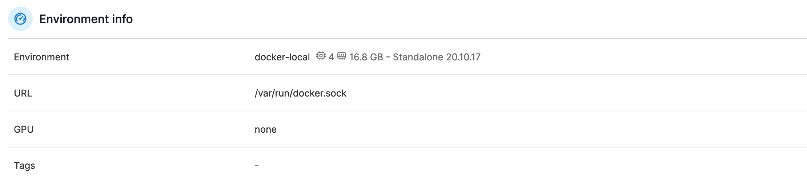
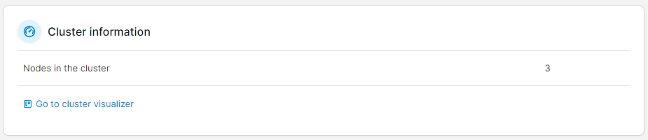
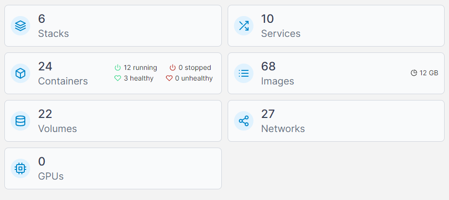

# Dashboard

The Docker/Swarm dashboard summarizes your Docker Standalone or Docker Swarm environment and shows the components that make up the environment.&#x20;

## Environment info


This section is visible only to Docker Standalone environments.


This section shows the environment name, its URL and port along with any [tags](../../admin/environments/tags.md#tagging-an-environment). You can also see the number of CPU cores (and their available memory), the Docker version, and whether or not the Portainer Agent is installed.&#x20;

<figure><figcaption></figcaption></figure>

## Cluster information


This section is visible only to Docker Swarm environments.


This section shows how many nodes are in the cluster and a link to the [cluster visualizer](swarm/cluster-visualizer.md).

<figure><figcaption></figcaption></figure>

## Summary tiles

The remaining dashboard is made up of tiles showing the number of [stacks](stacks/), [services](services/) (for Docker Swarm), [containers](containers/) (including health and running-status metrics), [images](images/) (and how much disk space they consume), [volumes](volumes/) and [networks](networks/), and GPUs (if enabled).

<figure><figcaption></figcaption></figure>

