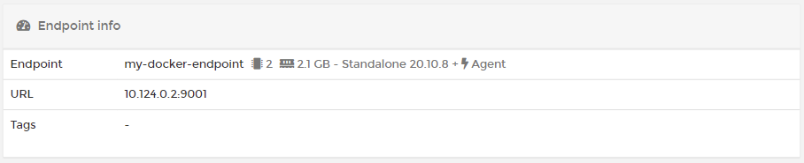
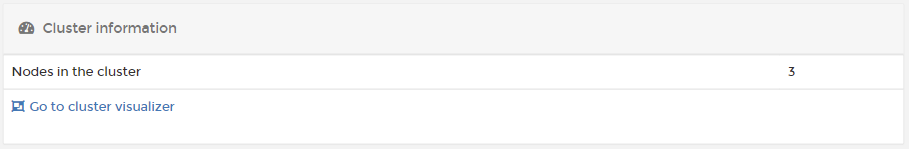
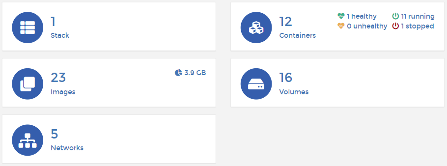

# Dashboard

The Docker/Swarm dashboard summarizes your Docker Standalone or Docker Swarm endpoint and shows the components that make up the environment. 

## Endpoint info


This section is visible only to Docker Standalone endpoints.


This section shows the endpoint name, its URL and port along with any [tags](../../admin/endpoints/tags.md#tagging-an-endpoint). You can also see the number of CPU cores \(and their available memory\), the Docker version, and whether or not the Portainer Agent is installed.

## Cluster information


This section is visible only to Docker Swarm endpoints.


This section shows how many nodes are in the cluster and contains a link to the [cluster visualizer](swarm/cluster-visualizer.md).

## Summary tiles

The remaining dashboard is made up of tiles showing the number of [stacks](stacks/), [services](services/) \(for Docker Swarm\), [containers](containers/) \(including health and running-status metrics\), [images](images/) \(and how much disk space they consume\), [volumes](volumes/) and [networks](networks/).

