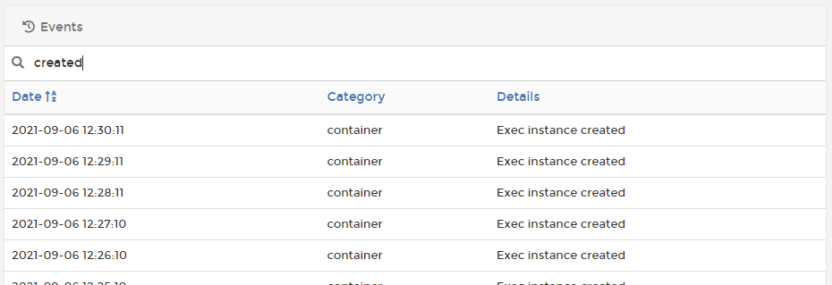

# Events


The **Events** menu is only available to Docker Standalone environments.


The **Events** section in Portainer lists container events that have occurred. You can filter the list using search, and you can also [view more information about each container](containers/inspect.md).

