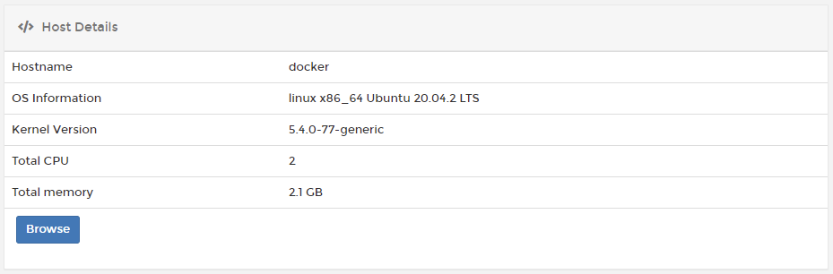
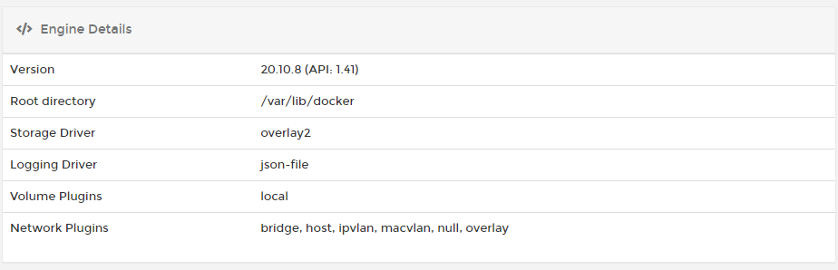

# Host


The **Host** menu is only available to Docker Standalone endpoints.


The **Host** section provides an overview of your endpoint environment. You can view information about your endpoint as well as configure endpoint-specific settings.



## Host Details

This section describes the host's basic configuration, including the hostname, OS information, kernel version, total CPU and memory. If the endpoint has the Portainer Agent installed, [host management features](setup.md#enable-host-management-features) are enabled, and a `/host` mount has been configured, you can also browse the host file system from here. 

## Engine Details

Learn more about the Docker engine running on your endpoint, including the Docker version, the root directory, storage and logging drivers and available volume and network plugins.

## PCI Devices and Physical Disks

These sections list the available PCI devices and physical disks on the host.


These sections are only visible when [host management features](setup.md#enable-host-management-features) are enabled for the endpoint.


