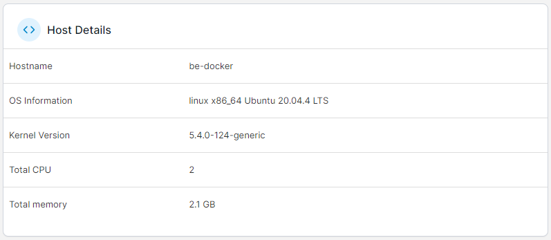
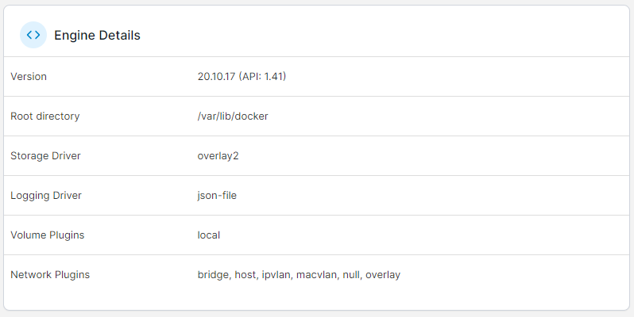
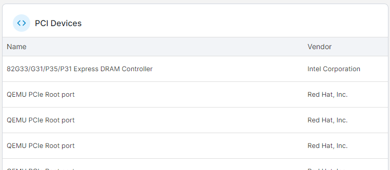

# Details \[EDIT]

This page provides information about the Docker host for the selected environment. The page is split into the following sections: Host Details, Engine Details, and (if enabled) PCI Devices and Physical Disks.


This page is only available on Docker Standalone environments.


## Host Details

This section describes the host's basic configuration, including the hostname, OS information, kernel version, total CPU and memory. If the environment has the Portainer Agent installed, [host management features](setup.md#enable-host-management-features) are enabled, and a `/host` mount has been configured, you can also browse the host file system from here.&#x20;

<figure><figcaption></figcaption></figure>

## Engine Details

Learn more about the Docker engine running on your environment, including the Docker version, the root directory, storage and logging drivers and available volume and network plugins.

<figure><figcaption></figcaption></figure>

## PCI Devices and Physical Disks

These sections list the available PCI devices and physical disks on the host.


These sections are only visible when [host management features](setup.md#enable-host-management-features) are enabled for the environment.


<figure><figcaption></figcaption></figure>

