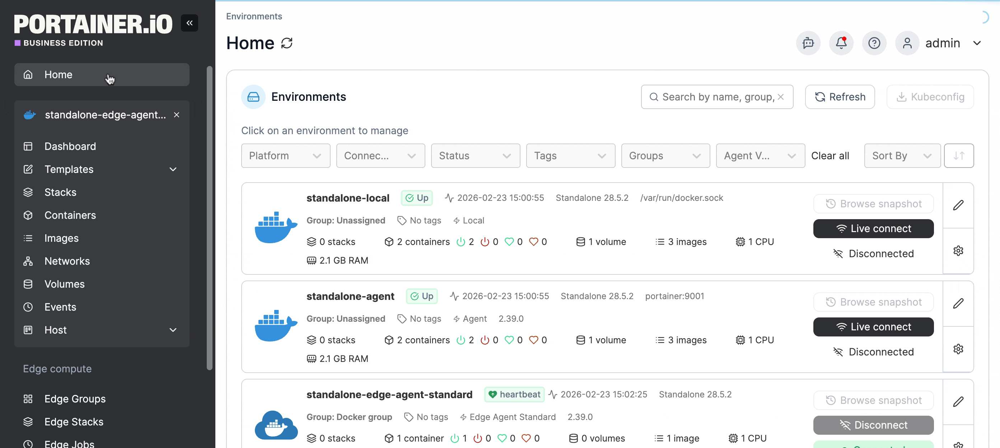

---
metaLinks:
  alternates:
    - https://app.gitbook.com/s/xdTQRpMuktD2l0URtOJO/user/docker/host/policies
---

# Policies

To view any policies that apply to the selected environment, from the menu expand **Host** then select **Policies**.&#x20;

<figure><figcaption></figcaption></figure>

Policy details from this view are read-only. As an admin user, you can select the **Edit** button next to the policy name to manage the policy. See the [Policies](../../../admin/environments/policies/) documentation for details.
