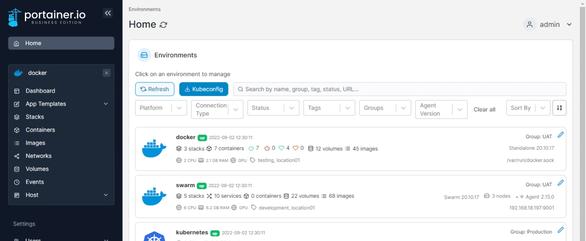
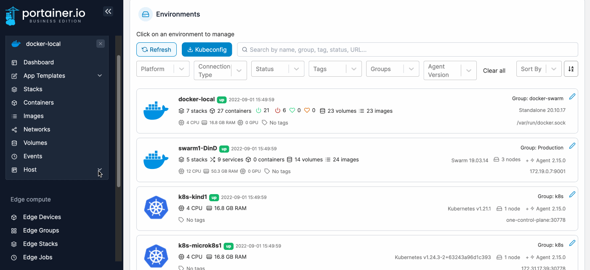
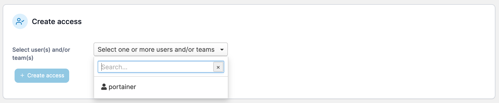

---
metaLinks:
  alternates:
    - https://app.gitbook.com/s/Dalese9Lv4CX6YKS1s45/user/docker/host/registries
---

# Registries


If access to an environment is being managed by a Docker registry [policy](../../../admin/environments/policies/), access can not be changed or modified from this view as the policy access takes precedence.



Registry access assigned here only applies to the selected environment. It is not global.


This view lets you manage access to each of the registries that are currently available.

## Adding a new registry

From the menu select **Host**, select **Registries** then click **Add registry**. When the global registries page appears, follow [these instructions](../../../admin/registries/add/).

<figure><figcaption></figcaption></figure>

## Managing access


If access to a registry is being managed by a registry [policy](../../../admin/environments/policies/), access can not be changed or modified from this view as the policy access takes precedence.


To configure access to a registry, from the menu select **Host** then select **Registries**.

<figure><figcaption></figcaption></figure>

Find the registry you want to manage then select **Manage access**.

<figure><figcaption></figcaption></figure>

From the dropdown, select the users or teams that you would like to have access, then click **Create access**.

<figure><figcaption></figcaption></figure>
