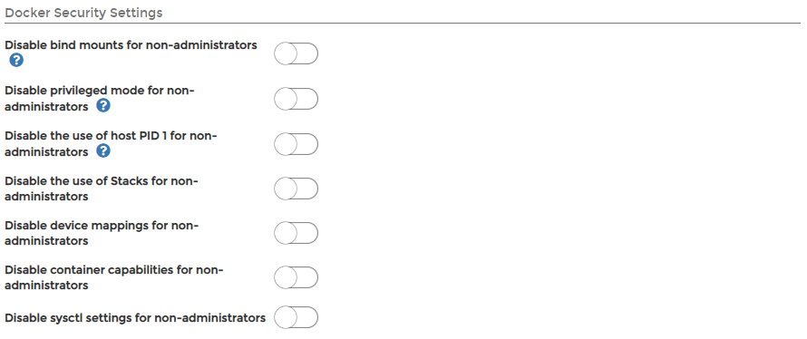

# Setup


The **Setup** section is only available to Docker Standalone endpoints.


Under **Setup**, you can make changes to your endpoint, enabling and disabling features and security settings.

## Host and Filesystem

For endpoints running the Portainer Agent, this section is where you configure how Portainer interacts with elements of the host.


For security, these features are disabled by default. Be sure that you understand the impact before enabling them.



### Enable host management features

Enabling host management features allows you to see the available devices and storage on the physical node as well as browse the node's filesystem. The endpoint must be [running the Portainer Agent](../../../start/install/agent/docker/) to use this functionality, and for filesystem browsing the root of the host must be bind-mounted to `/host` in the agent deployment:

```text
-v /:/host
```

For example, starting the Portainer Agent on Linux with the host filesystem mounted at `/host`:

```text
docker run -d -p 9001:9001 --name portainer_agent --restart=always -v /var/run/docker.sock:/var/run/docker.sock -v /var/lib/docker/volumes:/var/lib/docker/volumes -v /:/host portainer/agent
```

### Enable volume management for non-administrators

Enabling this feature allows non-administrator users to manage volumes on an endpoint. If this is disabled, users below administrator level have read-only access to volumes.

## Docker Security Settings

This section allows you to toggle assorted Docker-related security settings for the endpoint.



| Option | Overview |
| :--- | :--- |
| Disable bind mounts for non-administrators | Prevents non-admin users within Portainer from using bind mounts when creating containers and/or services/stacks. When toggled on, the option to attach to a host file system path is removed. |
| Disable privileged mode for non-administrators | Prevents non-admin users from elevating the privilege of a container to bypass SELinux/AppArmor. When toggled on, the option to select **Privileged** mode when [adding a container](../containers/add.md) is removed. |
| Disable the use of host PID 1 for non-administrators | Prevents non-admin users from requesting that a deployed container operates as the host PID. This is a security risk if used by a non-trustworthy authorized user because when they operate as PID1, they are in effect able to run any command in the container console as root on the host. |
| Disable the use of Stacks for non-administrators | This is a 'sledgehammer' approach to removing any possibility for non-admin users within Portainer to find and use weaknesses in the Docker architecture. Whilst Portainer has the ability to disable some of the more common exploits, we cannot possibly block them all because there are any number of capabilities that could be added to a container to attempt to gain access to the host. This feature simply allows an admin to disable all possible entry points. |
| Disable device mappings for non-administrators | Blocks users from mapping host devices into containers. Whilst the ability to map devices is generally used for good \(e.g. mapping a GPU into a container\), it can equally be used by non-trustworthy authorized users to map a physical storage device into a container. It is possible to mount `/dev/sda1` into a container, and then from a console of that container, the user would have complete access to the sda1 device without restriction. By toggling this on, Portainer blocks the ability for non-admins to map ANY devices into containers. |
| Disable container capabilities for non-administrators | Toggle on to hide the **Container capabilities** tab for non-administrators when they are [adding a container](../containers/add.md). |
| Disable sysctl settings for non-administrators | Toggle on to stop non-admin users from using sysctl options, preventing them from recreating, duplicating or editing containers. |

