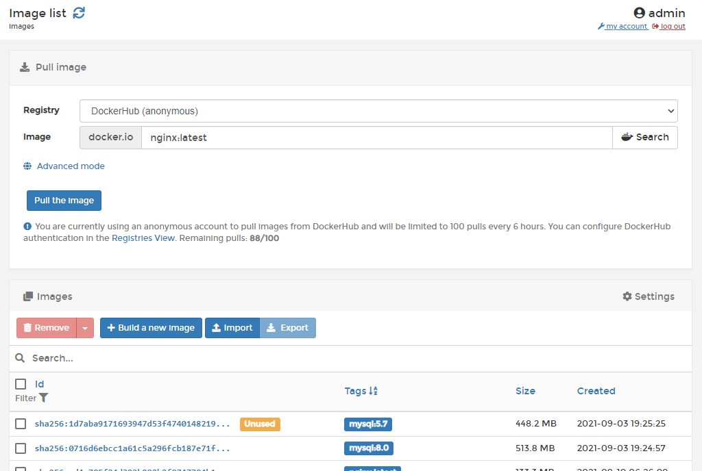

# Images

Images are what is used to build containers. Each image defines the pieces required to build and configure a container and can be reused many times. The **Images** section in Portainer lets you interact with the images in an environment.

You can pull images from Docker Hub or any other [registry](../../../admin/registries/add/):



You can also view a list of the images that are currently available in an environment, including their IDs, usage states, tags, sizes and creation dates. There are many other options available:







