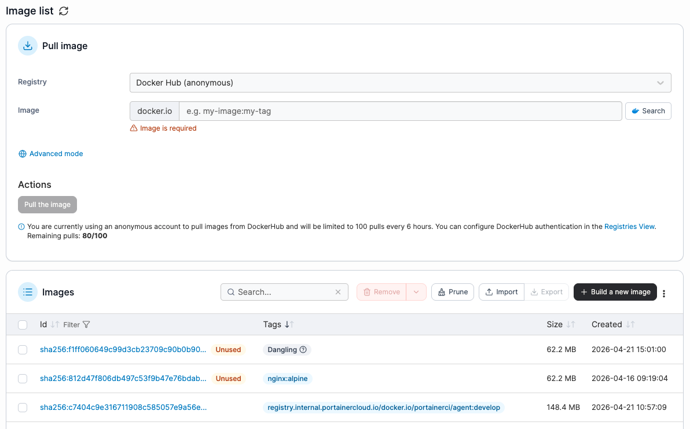

---
metaLinks:
  alternates:
    - https://app.gitbook.com/s/Dalese9Lv4CX6YKS1s45/user/docker/images
---

# Images

Images are what is used to build containers. Each image defines the pieces required to build and configure a container and can be reused many times. The **Images** section in Portainer lets you interact with the images in an environment.

<figure><figcaption></figcaption></figure>

You can pull images from Docker Hub or any other [registry](../../../admin/registries/add/):


[pull.md](pull.md)


The **Images** table provides an overview of all images currently available in an environment, including each image's ID, usage status, tags, size, and creation date.

From this table you can also:

* **Build** a new image
* **Import** or **Export** an image
* **Prune** dangling and unused images to reclaim disk space


[build.md](build.md)



[import.md](import.md)



[export.md](export.md)



[prune-dangling-and-unused-images.md](prune-dangling-and-unused-images.md)

