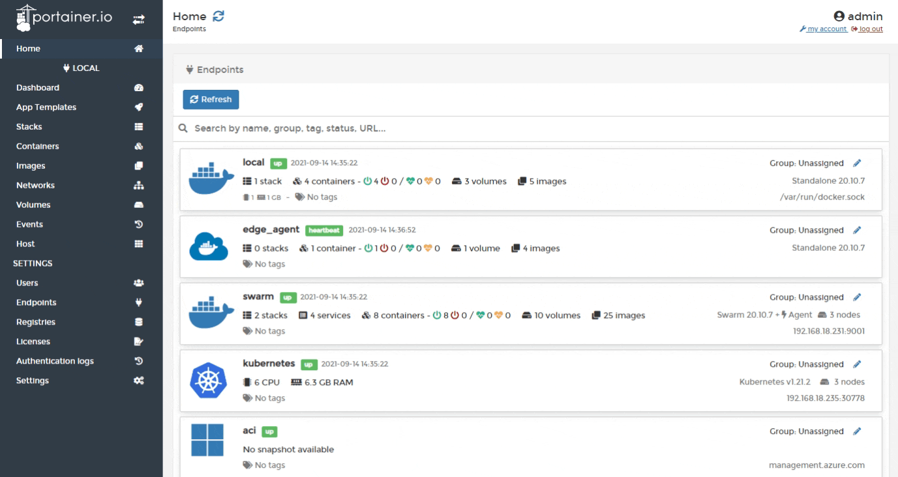
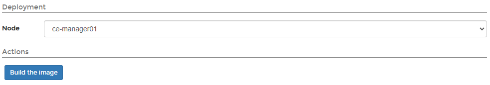
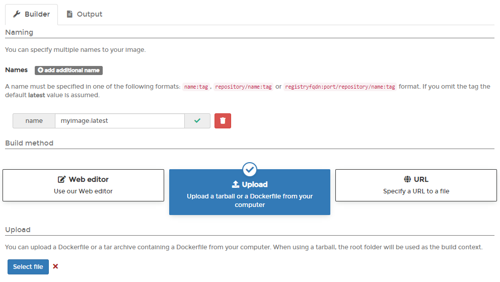
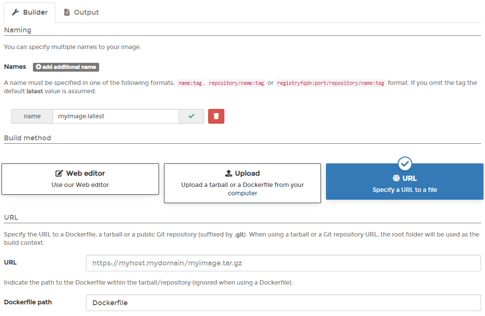

# Build a new image

There are three ways you can build new images.


On a multi-node environment, the built image will only be available on the node you select in the **Deployment** section. To make the image available to all nodes, consider [adding a registry](../../../admin/registries/add/) to Portainer.



When building an image with Portainer, you are unable to use `ADD` or `COPY` commands referencing files on the host. We recommend using `wget` or similar to retrieve files from a HTTP/S URL instead.


## Method 1: Using the Portainer web editor

From the menu select **Images** then click **Build a new image**.

Next, give the image a descriptive name \(you can enter multiple names\), select the **Web editor** option under **Build method**, then write your Dockerfile in the web editor.

Scroll down and select the node you want to save the image on \(if on a multi-node environment\) then click **Build the image**.

When the build is finished, select the **Output** tab to view the build history and the result.

## Method 2: Uploading a Dockerfile

If you have an existing Dockerfile, you can upload it to Portainer and use it to build the image.

From the menu select **Images** then click **Build a new image**.

Next, give the image a descriptive name \(you can enter multiple names\), select the **Upload** option under **Build method**, then browse to and upload the Dockerfile.

Scroll down and select the node you want to save the image on \(if on a multi-node environment\) then click **Build the image**.

When the build is finished, select the **Output** tab to view the build history and the result.

## Method 3: Providing a Dockerfile from a URL

If the Dockerfile is hosted on the Internet \(either in a tarball or a public GitHub repository\), you can download it directly to Portainer via its URL.

From the menu select **Images** then click **Build a new image**.

Next, give the image a descriptive name \(you can enter multiple names\), select the **Upload** option under **Build method**, then enter the **URL** of the file and the **Dockerfile path** within the tarball or repository.

Scroll down and select the node you want to save the image on \(if on a multi-node environment\) click **Build the image**.

When the build is finished, select the **Output** tab to view the build history and the result.

