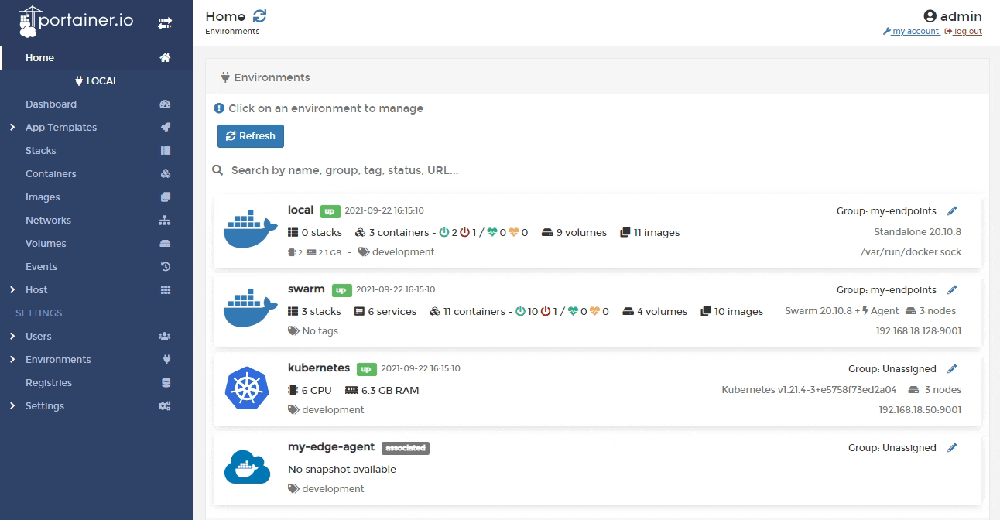
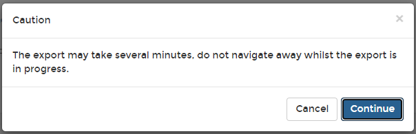

# Export an image

You can export any Docker image stored on any node. This is useful when you need to move a container from one host to another, or simply make a backup of the images.


If you export a container to a tar file, the volumes won't get exported with it. You will need to save the data from those volumes using a different method.


From the menu select **Images**, select the image you want to export then click **Export this image**.

When the warning message appears, click **Continue**.

When the image has downloaded, a success message will appear, and your browser should automatically download the resulting tar file.\
