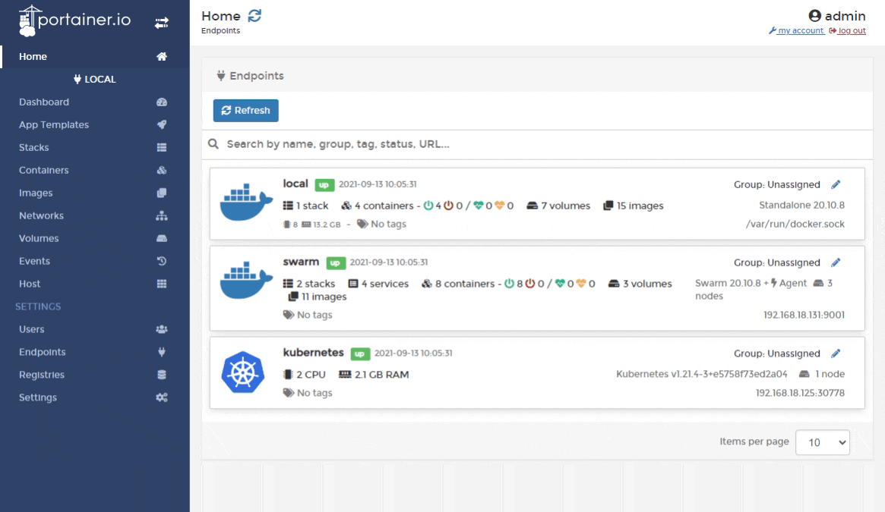
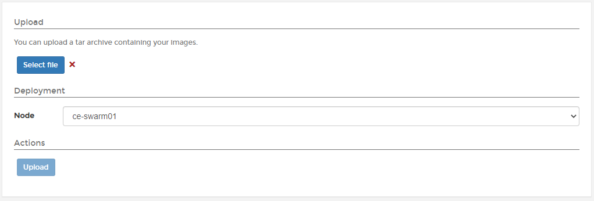

# Import an image

You can import images from other Portainer instances, the Docker CLI or the Docker Swarm CLI.

From the menu select **Images** then click **Import**.

Select the image, select the node where you will save the image then click **Upload**.


On a multi-node environment, the image you import will only be available on the node selected under **Deployment**. If you want to make the image available to all nodes, consider [adding a registry](../../../admin/registries/add/) to Portainer.


