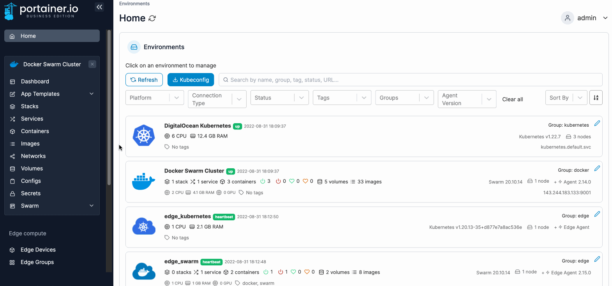
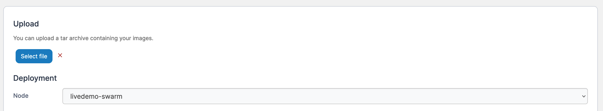
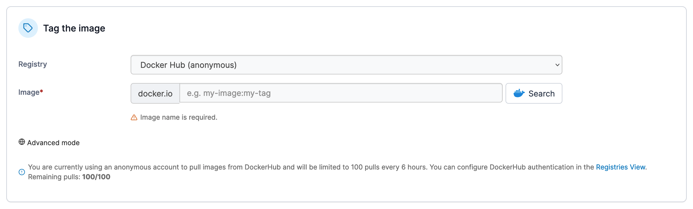
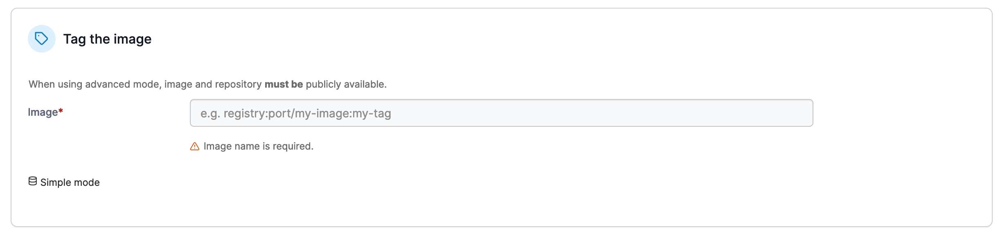

# Import an image

You can import images from other Portainer instances, the Docker CLI or the Docker Swarm CLI.

From the menu select **Images** then click **Import**.

<figure><figcaption></figcaption></figure>

Click **Select file** to browse for the image file to upload. Portainer supports `.tar`, `.tar.gz`, `.tar.bz2` and `.tar.xz` files. If you are on a multi-node environment, select the node where you wish to save the image.


On a multi-node environment, the image you import will only be available on the node selected under **Deployment**. If you want to make the image available to all nodes, consider [adding a registry](../../../admin/registries/add/) to Portainer.


<figure><figcaption></figcaption></figure>

When importing an image you can also select to tag the image using a registry you have preconfigured in Portainer. Select the **Registry** from the dropdown and enter the image name and tag.&#x20;

<figure><figcaption></figcaption></figure>

If you wish to tag the image with a registry that is not configured within Portainer, click **Advanced mode** and enter the registry, port, image and tag as required.


If you want to tag the image locally rather than in a registry, use **Advanced mode** and simply specify the image name and tag, without a registry.


<figure><figcaption></figcaption></figure>

When you're ready, click **Upload** to import your image.

