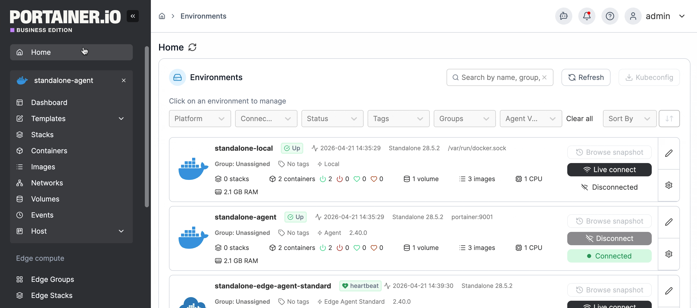
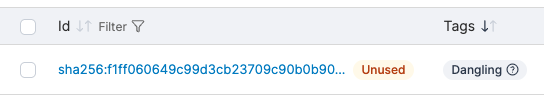
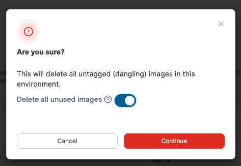

# Prune dangling and unused images

To remove dangling or unused images from an environment, navigate to **Images** in your environment menu and click **Prune** from the **Images** list.

<figure><figcaption></figcaption></figure>

You can identify dangling images by the **dangling** tag, and unused images by the **unused** label displayed next to the image ID.

<figure><figcaption></figcaption></figure>

On selecting **Prune**, Portainer will by default delete all untagged (dangling) images, equivalent to running `docker image prune`. To also remove tagged images that are not in use by any container, select **Delete all unused images** in the confirmation dialog - this is the equivalent to running `docker image prune -a`.

<figure><figcaption></figcaption></figure>

Press **Continue** to complete the prune. On success, a confirmation dialog will show how much disk space was reclaimed.
