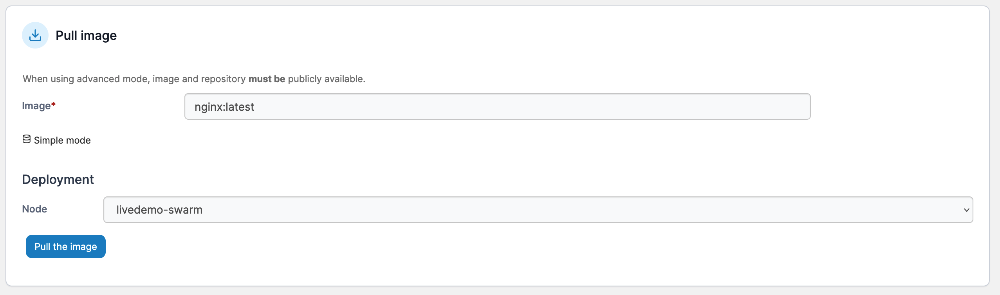

# Pull an image

You can pull images from any registry that has been [added to Portainer](../../../admin/registries/), or using advanced mode, from a custom external registry.


On a multi-node environment, the pulled image will only be available on the node you select in the **Deployment** section. To make the image available to all nodes, consider [adding a registry](../../../admin/registries/add/) to Portainer.


## Method 1: Pulling images in simple mode

This method lets you pull images from Docker Hub or from another registry that you have connected with before.

From the menu select **Images**. Select the registry to use then enter the name of the image. On a multi-node environment, select the node to deploy to.

<figure><figcaption></figcaption></figure>

When you're ready, click **Pull the image**.

## Method 2: Pulling images in advanced mode

Using advanced mode, you can define a custom registry URL, port and image. This is ideal if you run your own private registry but don't want to add it to the [registries](../../../admin/registries/) list in Portainer.

From the menu select **Images** then select **Advanced mode**. Next, enter the registry, port and image in the **Image** box. On a multi-node environment, select the node to deploy to.

<figure><figcaption></figcaption></figure>

When you're ready, click **Pull the image**.
