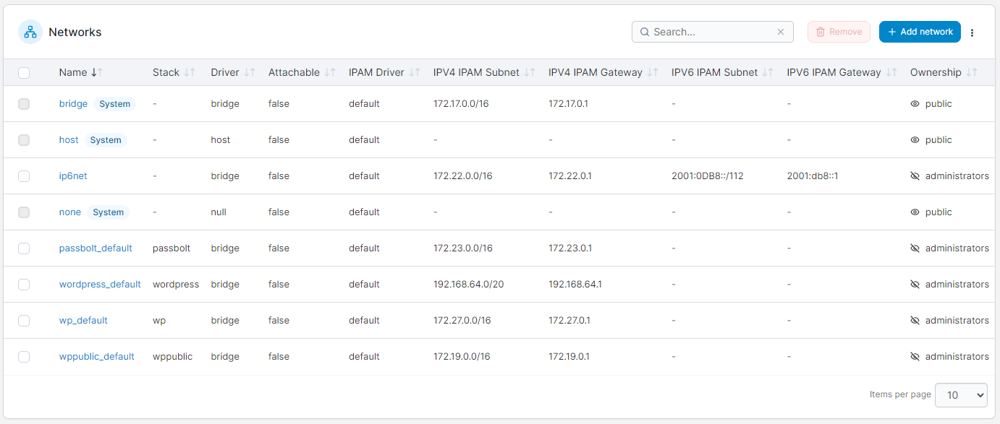

# Networks

Portainer lets you add, remove and manage networks in your environment.

<figure><figcaption></figcaption></figure>


[add.md](add.md)



[remove.md](remove.md)


## Supported network types

Portainer supports these types of networks:

### bridge

If you don’t specify a driver, this type of network will be created by default. Bridge networks are normally used when your applications run in standalone containers that need to communicate with each other.

### macvlan

macvlan networks allow you to assign a MAC address to a container, making it appear as a physical device on your network. The Docker daemon routes traffic to containers based on their MAC addresses. Using the macvlan driver is sometimes the best choice when dealing with legacy applications that expect to be directly connected to the physical network, rather than routed through the Docker host’s network stack.

### ipvlan

Similar to macvlan, the key difference being that the endpoints have the same MAC address. ipvlan supports L2 and L3 modes. In ipvlan L2 mode, each endpoint gets the same MAC address but different IP addresses. In ipvlan L3 mode, packets are routed between endpoints, giving better scalability.

### overlay

overlay networks connect multiple Docker daemons together and enable swarm services to communicate with each other. You can also use overlay networks to facilitate communication between a swarm service and a standalone container, or between two standalone containers on different Docker daemons.
