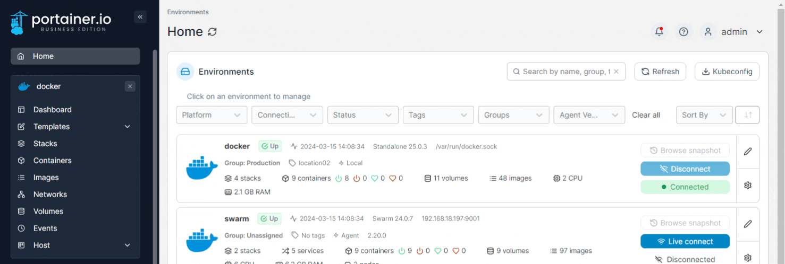

# Add a new network

From the menu select **Networks** then click **Add network**.

<figure><figcaption></figcaption></figure>

Define the new network, using the table below as a guide.

| Field/Option                       | Overview                                                                                                                                                                                                                                                  |
| ---------------------------------- | --------------------------------------------------------------------------------------------------------------------------------------------------------------------------------------------------------------------------------------------------------- |
| Name                               | Give the network a descriptive name.                                                                                                                                                                                                                      |
| Driver                             | Define the [type of network](./#supported-network-types) you will use.                                                                                                                                                                                    |
| Driver options                     | Set in place any options related to your network driver, if required.                                                                                                                                                                                     |
| IPv4 Network configuration         | 
Define IPv4 range, subnet, gateway and exclude IP. If no information is entered here, Docker will automatically assign an IPv4 range. If you need to exclude IPs from the range, click <strong>Add excluded IP</strong> and complete the field.
 |
| IPv6 Network configuration         | 
Define IPv6 range, subnet, gateway and exclude IP. If no information is entered here, Docker will automatically assign an IPv6 range. If you need to exclude IPs from the range, click <strong>Add excluded IP</strong> and complete the field.
 |
| Labels                             | Click **Add label** and complete the name and value fields to specify a label for the network.                                                                                                                                                            |
| Isolated network                   | Toggle this option on to isolate any containers created in this network to this network only, with no inbound or outbound connectivity.                                                                                                                   |
| Enable manual container attachment | Toggle this option on to allow users to attach the network to running containers.                                                                                                                                                                         |
| Deployment                         | On multi-node clusters, select the node where the network will be created.                                                                                                                                                                                |

<figure><figcaption></figcaption></figure>

When you're finished, click **Create the network**.
