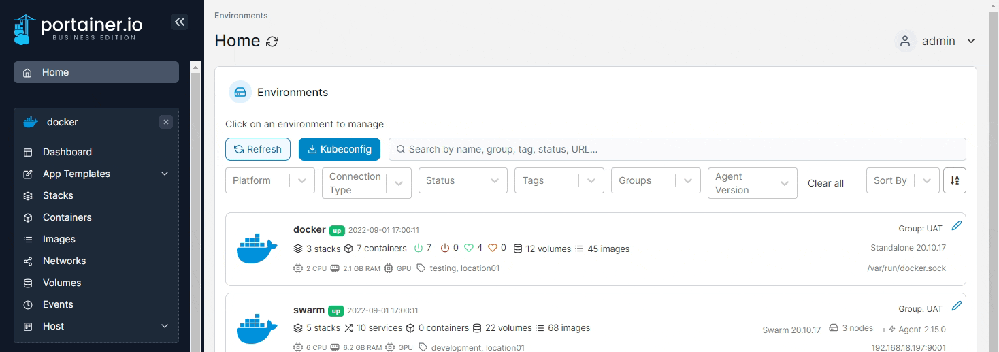

# Remove a network


You must detach all containers from a network before you can remove it.


From the menu select **Networks**, tick the checkbox next to the network you want to remove then click **Remove**.

<figure><figcaption></figcaption></figure>
