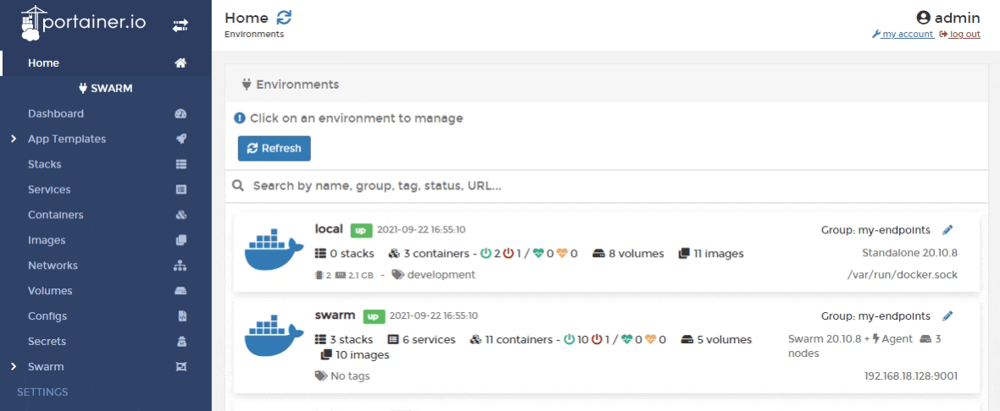

# Add a new secret

From the menu select **Secrets** then click **Add secret**.

Next, give the secret a descriptive name and write a definition of the secret in the **Secret** field. Toggle **Encode secret** on if you want to encode the secret (useful when you use a plain-text password).

When you're finished, click **Create the secret**.

Once you have created your secret, you can [add it to an existing service](../services/configure.md#secrets) or to a new service [during creation](../services/add.md).
