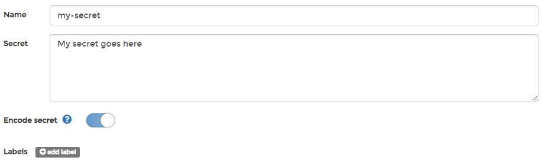

# Add a secret

From the menu select **Secrets** then click **Add secret**.

Next, give the secret a descriptive name and write a definition of the secret in the **Secret** field. Toggle **Encode secret** on if you want to encode the secret \(useful when you use a plain-text password\).

 When you're finished, click **Create the secret**.

