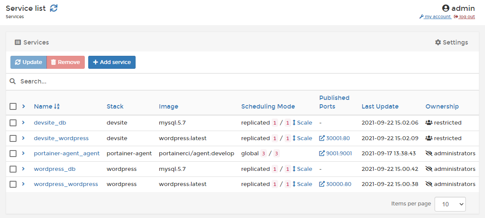

# Services


The **Services** menu is only available to Docker Swarm endpoints.


A service consists of an image definition and container configuration as well as instructions on how those containers will be deployed across a Swarm cluster.


[add.md](add.md)



[configure.md](configure.md)


Once a service has been created you can scale it to meet your needs, as well as view individual task status and logs.


[scale.md](scale.md)



[tasks.md](tasks.md)



[logs.md](logs.md)


If you need to undo some changes to a service, you can roll it back.


[rollback.md](rollback.md)


You can also configure webhooks for your services.


[webhooks.md](webhooks.md)


