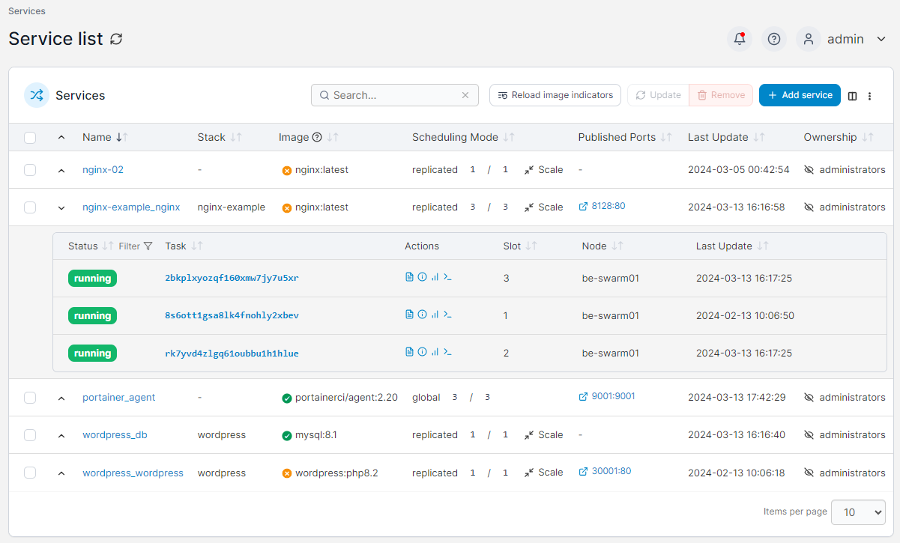

# Services


The **Services** menu is only available to Docker Swarm endpoints.


A service consists of an image definition and container configuration as well as instructions on how those containers will be deployed across a Swarm cluster.

<figure><figcaption></figcaption></figure>

When the [new image indicator](../swarm/setup.md#other) feature is enabled, the **Images up to date** column indicates whether the local images in the service are up to date, with a green tick indicating they are up to date and an orange cross indicating that there is a newer version of an image available at the remote registry. A grey hyphen indicates Portainer was unable to determine whether there is an update available for the images.

You can click the **Reload image indicators** button to recheck the images for all your services for updates, or to recheck a single service's images you can click the image indicator icon for that service.

For more on how this works, have a look at [this knowledge base article](https://portal.portainer.io/knowledge/how-does-the-image-update-notification-icon-work).


[add.md](add.md)



[configure.md](configure.md)


Once a service has been created you can scale it to meet your needs, as well as view individual task status and logs.


[scale.md](scale.md)



[tasks.md](tasks.md)



[logs.md](logs.md)


If you need to undo some changes to a service, you can roll it back.


[rollback.md](rollback.md)


You can also configure webhooks for your services.


[webhooks.md](webhooks.md)


