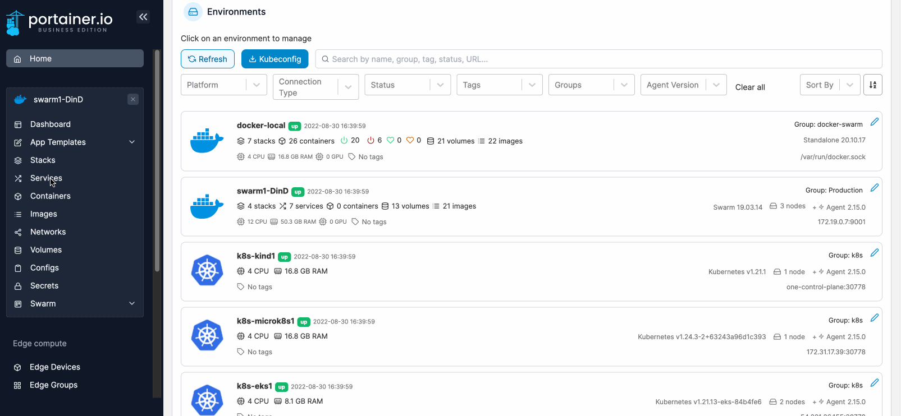
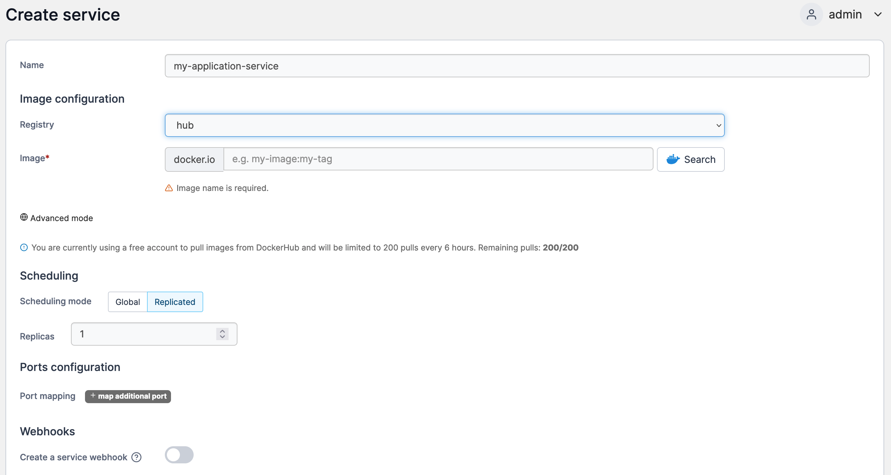

# Add a new service

From the menu click **Services** then click **Add service**.

<figure><figcaption></figcaption></figure>

Complete the fields, using the table below as a guide.

| Field/Option             | Overview                                                                                                                                                                             |
| ------------------------ | ------------------------------------------------------------------------------------------------------------------------------------------------------------------------------------ |
| Name                     | Give the service a descriptive name.                                                                                                                                                 |
| Registry                 | Select the registry that contains the image you wish to use for the service.                                                                                                         |
| Image                    | Enter the name of the image. If you're using Docker Hub you can also search for images from here.                                                                                    |
| Scheduling mode          | Select either to replicate the service on the same host or deploy it globally with one container on each host.                                                                       |
| Replicas                 | Set the number of replicas (only if the scheduling mode is set to **Replicated**).                                                                                                   |
| Port mapping             | Define the ports to expose on the new service.                                                                                                                                       |
| Create a service webhook | Toggle on to create a [webhook](webhooks.md) for the service. You can send a POST request to this endpoint to automate pulling the most up-to-date image and re-deploy your service. |

<figure><figcaption></figcaption></figure>

You can also configure any advanced options for the service in the bottom section.

When you're finished click **Create the service**.
