# Configure service options

From the menu select **Services** then select the service you want to configure.&#x20;

<figure>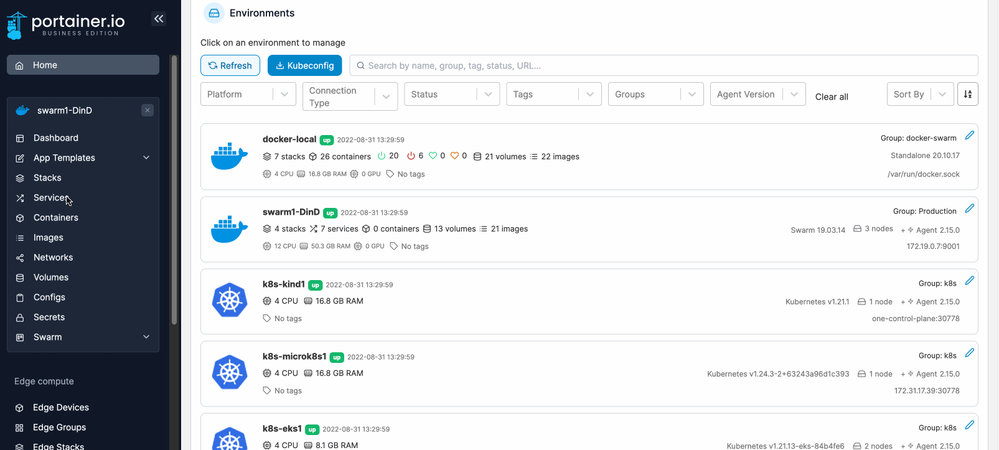<figcaption></figcaption></figure>

## Service details

In this section you can:

* View a summary of the details about the service.
* Configure the number of replicas.
* Toggle the [service webhook](webhooks.md) on or off.
* View the [service logs](logs.md).
* Update, [roll back](rollback.md) or delete the service.

<figure><figcaption></figcaption></figure>

## Container specification configuration options

### Change container image

Here you can replace the container image with a different image. Select the registry, enter the image name, then click **Apply changes**.

<figure>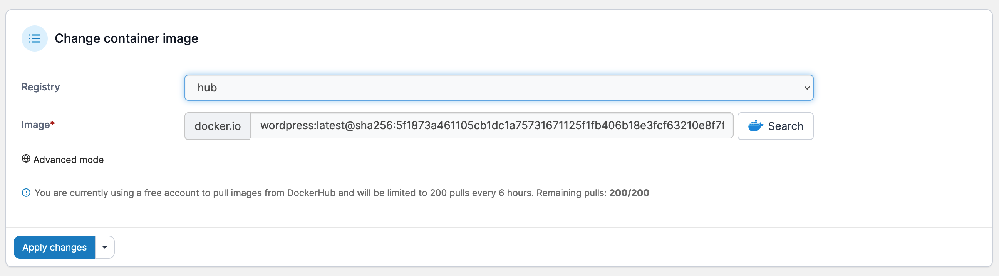<figcaption></figcaption></figure>

### Environment variables

It's best to set environment variables when you [create a container](../containers/add.md) and before deployment. You can still set or edit these variables after deployment if you wish.

<figure>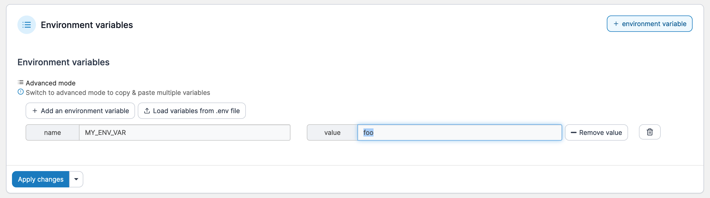<figcaption></figcaption></figure>

### Container labels

Labels give you a way to record information about a container, such as the way it's configured. Labels can also be used by Portainer to [hide containers from the interface](../../../admin/settings/#hidden-containers).

<figure>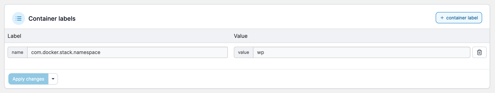<figcaption></figcaption></figure>

### Mounts

You have the option to either mount or bind volumes in Portainer, and you can also make them read only. To add a mount, first select either **Volume** or **Bind** from the **Type** dropdown.

#### For volume mounts:

Select the volume from the **Source** dropdown, enter the container path in the **Target** field tick **Read only** if required then click **Apply changes**.

<figure>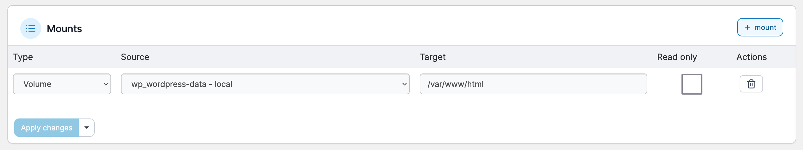<figcaption></figcaption></figure>

#### For bind mounts:

Enter the source path in the **Source** field, enter the container path in the **Target** field, tick **Read only** if required then click **Apply changes**.

<figure>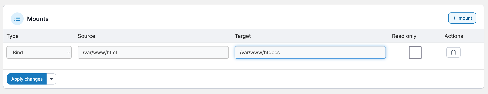<figcaption></figcaption></figure>

## Networks & ports configuration options

### Networks

You can define one or more networks for a service either before or after deployment. Simply select the network from the dropdown then click **Apply changes**.

<figure>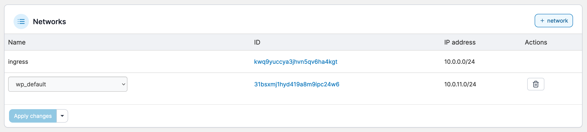<figcaption></figcaption></figure>

### Published ports

Use this setting to publish ports so they can access a container from outside of the host. You can either add new ports or update existing ports.

<figure>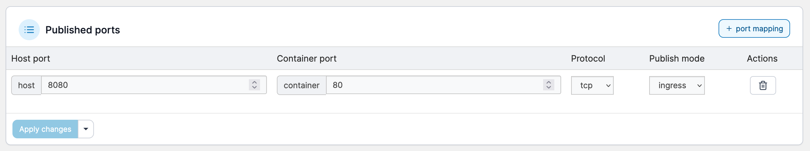<figcaption></figcaption></figure>

### Hosts file entries

Lets you manually specify a hostname or URL and associate the URL to an internal or external IP address.

<figure>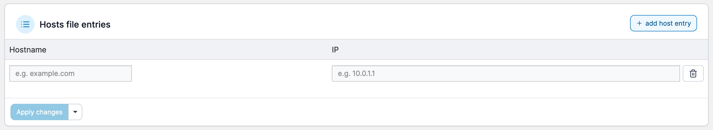<figcaption></figcaption></figure>

## Service specification settings

### Resource limits and reservations

Sets limits on resource utilization, such as memory, CPU reservation and CPU limit.

<figure>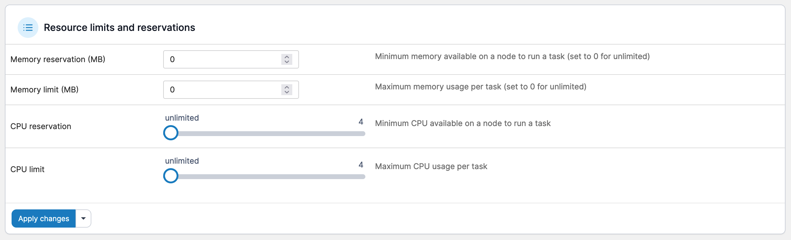<figcaption></figcaption></figure>

### Placement constraints

Use placement constraints to control which nodes a service can be assigned to.

<figure>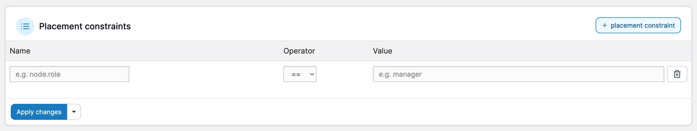<figcaption></figcaption></figure>

### Placement preferences

While placement constraints limit the nodes a service can run on, placement preferences attempt to place tasks on appropriate nodes in an algorithmic way (by default they are spread evenly).

<figure>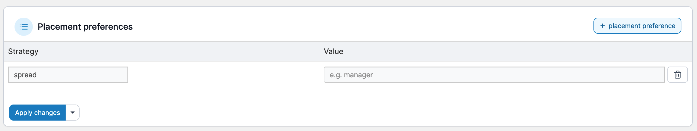<figcaption></figcaption></figure>

### Restart policy

Docker's restart policies ensure that linked containers are restarted in the correct order, and control the conditions under which they are restarted:

* **Any**: Restart the container under any conditions (restarted host or Docker daemon).
* **On Failure**: Restart the container if it exits due to an error which manifests as a non-zero exit code.
* **None**: Do not automatically restart the container.

You can also adjust the restart delay, maximum attempts and restart window.

<figure>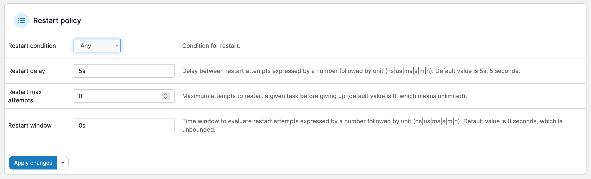<figcaption></figcaption></figure>

### Update configuration

Updates a service according to the parameters you specify. The parameters specified here are the same as `docker service create` (see [Docker's own documentation](https://docs.docker.com/engine/reference/commandline/service\_create/) for more information).

Normally, updating a service will only cause the service’s tasks to be replaced with new ones if a change to the service requires recreating the tasks for it to take effect.

<figure>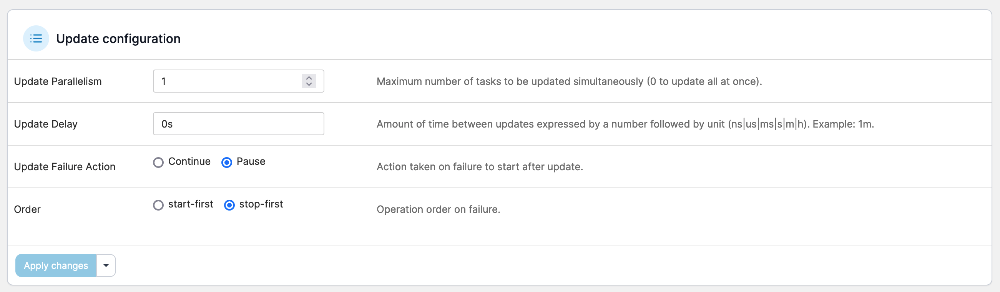<figcaption></figcaption></figure>

### Logging driver

Docker includes logging mechanisms called _logging drivers_ that get information from the containers and services you're running. Each Docker daemon has a default logging driver which each container will use, unless you configure them to use a different logging driver.

<figure><figcaption></figcaption></figure>

### Service labels

Lets you add metadata to containers using Docker labels either via an array or a dictionary. We recommend that you use reverse-DNS notation to stop labels from conflicting with those used by other software.

<figure>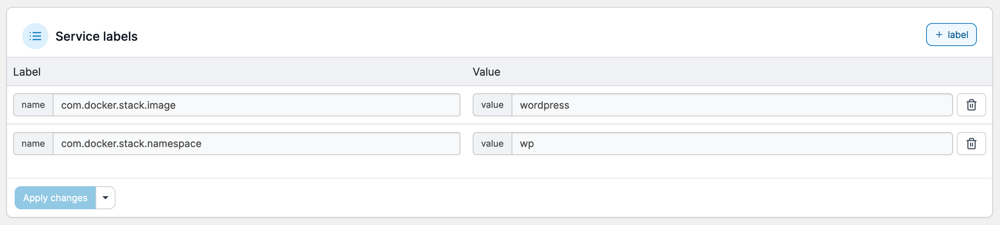<figcaption></figcaption></figure>

### Configs

Docker 17.06 introduced Swarm service configs. These allow you to store non-sensitive information such as configuration files outside a service’s image or running containers. This keeps images as generic as possible and removes the need to bind-mount configuration files into containers or use environment variables.

<figure>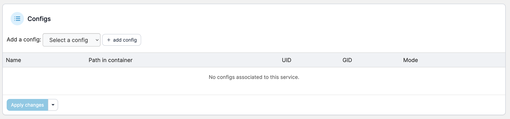<figcaption></figcaption></figure>

### Secrets

In the context of Docker Swarm services, a secret is a blob of data such as a password, SSH private key, SSL certificate, or another piece of data that should not be transmitted over a network or stored unencrypted in a Dockerfile or in your application’s source code.

<figure>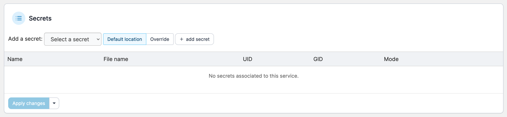<figcaption></figcaption></figure>
