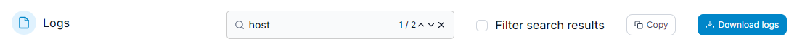
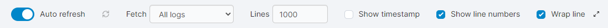

# View service logs

From the menu select **Services**, select the service whose logs you want to view then click **Service logs**.

<figure><figcaption></figcaption></figure>

Here you can see the contents of the Docker logs for your service.&#x20;

<table><thead><tr><th width="236">Field/Option</th><th>Overview</th></tr></thead><tbody><tr><td>Search</td><td>Enter a string to search the log output. You can see the number of results for your search and move through each result with the up and down arrows.</td></tr><tr><td>Filter search results</td><td>When enabled, display only the log lines that contain your search string.</td></tr><tr><td>Copy</td><td>Click this button to copy the currently displayed log lines to your clipboard.</td></tr><tr><td>Download logs</td><td>Click this button to download your log.</td></tr></tbody></table>

<figure><figcaption></figcaption></figure>

You can also set various options for how the logs are displayed:

<table><thead><tr><th width="238">Field/Option</th><th>Overview</th></tr></thead><tbody><tr><td>Auto-refresh</td><td>Toggle this option off to disable auto refreshing of the log view. When off, you can click the refresh icon to the right of the toggle to manually refresh the view.</td></tr><tr><td>Fetch</td><td>Select the time period from which to retrieve the logs.</td></tr><tr><td>Lines</td><td>Limit the number of lines per log file (the default is 1000).</td></tr><tr><td>Show timestamp</td><td>When enabled, display a timestamp before each log line.</td></tr><tr><td>Show line numbers</td><td>When enabled, display line numbers for each log line.</td></tr><tr><td>Wrap line</td><td>When enabled, lines longer than the screen width will be wrapped onto the next line.</td></tr><tr><td>Full screen</td><td>Click the full screen icon to expand the log display to fill your screen.</td></tr></tbody></table>

<figure><figcaption></figcaption></figure>
