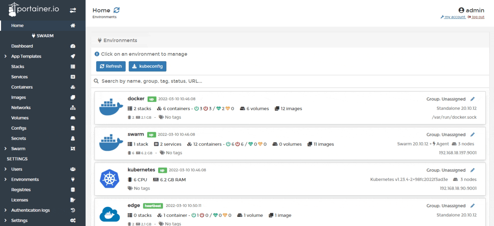
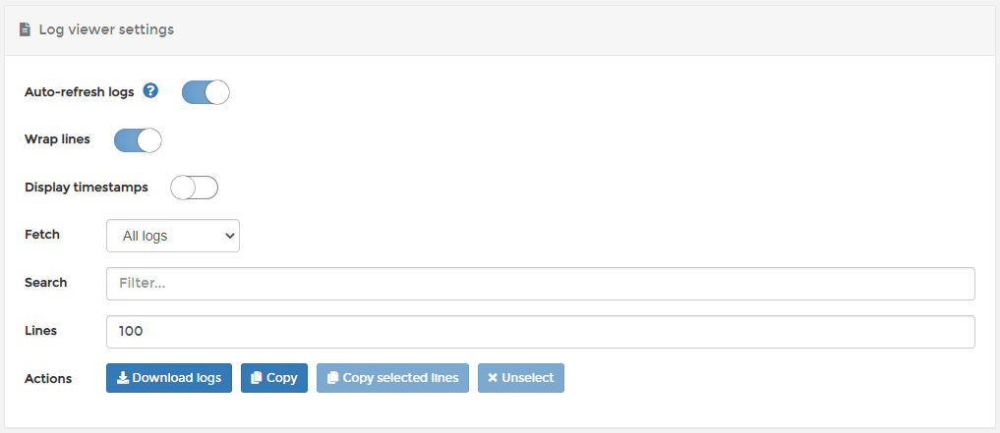

# View service logs

From the menu select **Services**, select the service whose logs you want to view then click **Service logs**.

The following options are available in each log:

| Field/Option       | Overview                                                                                                                |
| ------------------ | ----------------------------------------------------------------------------------------------------------------------- |
| Auto-refresh logs  | Toggle off to pause the logging process and auto-scrolling.                                                             |
| Wrap lines         | Make it easier to read long lines of information.                                                                       |
| Display timestamps | Useful when you need to know when logs were created.                                                                    |
| Fetch              | Change the logging frequency.                                                                                           |
| Search             | Lets you search for specific keywords found in the log file.                                                            |
| Lines              | Limit the number of lines per log file (the default is 100).                                                            |
| Actions            | These options let you download the logs to your local machine, copy all lines or selected lines, or unselect all lines. |

