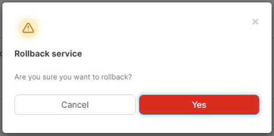

# Roll back a service

If you make a change to a service in Docker Swarm and your applications are no longer working as you expect, you can roll back to the previous state.

From the menu select **Services**, select the service to roll back then click **Rollback the service**.

<figure><figcaption></figcaption></figure>

When the confirmation message appears, click **Yes**.

<figure><figcaption></figcaption></figure>
