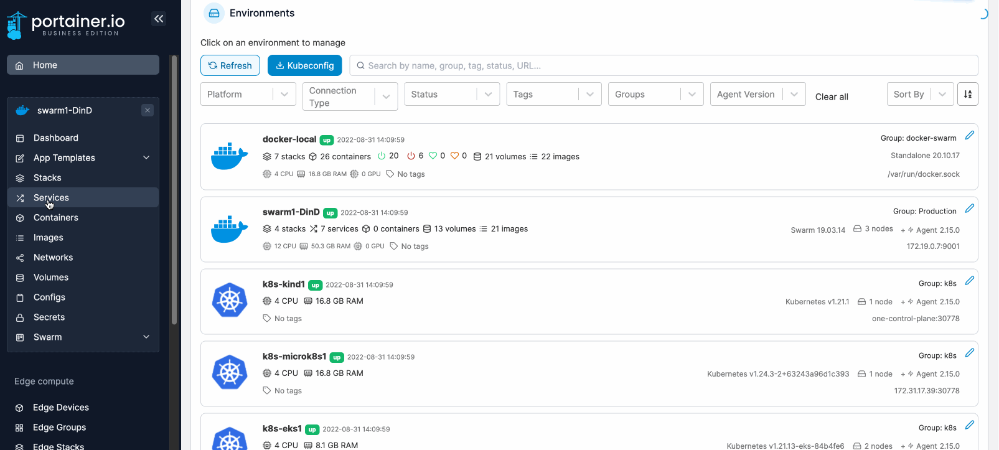

# Scale a service

From the menu select **Services** then select **scale** next to the service you want to scale (in the **Scheduling Mode** column).

<figure><figcaption></figcaption></figure>

Select the number of replicas you want to create for the service then click the tick icon to apply. If scaling is successful, a success message will appear at the top-right of the screen. Refresh the page until the running replicas appear.


Depending on container size, there might be a slight delay before the replicas appear on screen.

