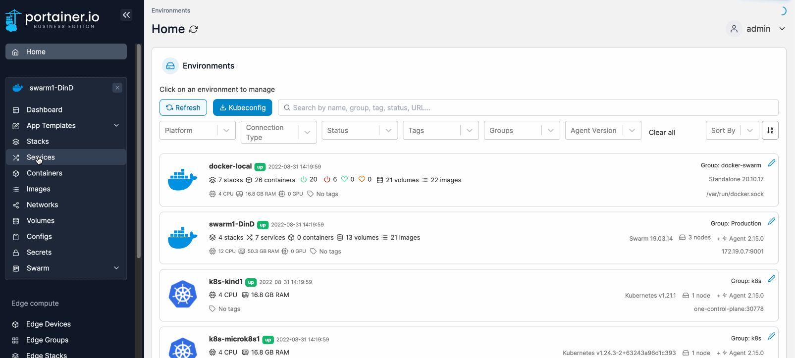
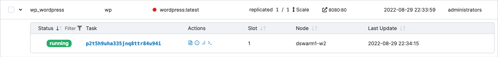

# View the status of a service task

Services in a Docker Swarm environment are a collection of tasks (or individual containers). This article explains how to quickly see the status of the containers that make up each service.

From the menu select **Services** then click the down-arrow to the left of the service you want to inspect. The tasks that make up the service will be shown.

<figure><figcaption></figcaption></figure>

Select any individual task to go to the container details page for that task. You can also perform various actions on individual tasks by using the icons in the **Actions** column.

<figure><figcaption></figcaption></figure>
