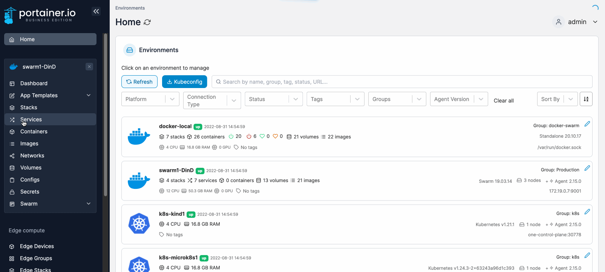
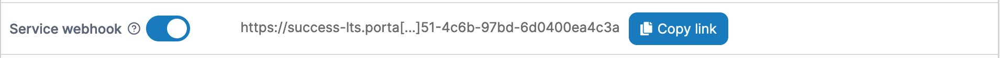

# Webhooks

A webhook is a POST request sent to a URL that you define in Docker Hub or another registry. Use webhooks to trigger an action or a service in response to a repository push event.


Webhooks are only available on non-Edge environments (environments running Portainer Server or Portainer Agent, not the Portainer Edge Agent). This is because the tunnel to the Portainer Edge Agent is only opened on-demand, and therefore would mean there is no way to expose a webhook permanently.


## Enabling a service webhook

From the menu select **Services** then select the service that you want to configure the webhook for.

<figure><figcaption></figcaption></figure>

In the **Service details** screen toggle the **Service webhook** option on. When the URL appears, click **Copy link**. This URL will be used to configure the webhook in your chosen registry.

<figure><figcaption></figcaption></figure>

This example shows how to trigger the webhook using `redeploy`:

```
<form action="https://portainer:9443/api/webhooks/638e6967-ef77-4906-8af8-236800621360" method="post">
  Redeploy with latest image of same tag <input type="submit" />
</form>
```

This example shows how to trigger the webhook using `update service image with a different tag`:

```
<form action="https://portainer:9443/api/webhooks/638e6967-ef77-4906-8af8-236800621360?tag=latest" method="post">
  Update Service image with different tag <input type="submit" />
</form>
```

## Using environment variables with webhooks

When triggering a webhook, environment variables can be passed through the endpoint and referenced within services' compose files.


This functionality is only available in Portainer Business Edition.


To specify an environment variable on a webhook, add it as a variable to the URL. For example, to pass a `SERVICE_TAG` variable with the value `development`:

```
https://portainer:9443/api/webhooks/1d251d96-fb34-4172-a0a1-d0655467b897?SERVICE_TAG=development
```

To reference the `SERVICE_TAG` variable in your compose file with a fallback to the value `stable`:

```
services:
  my-service:
    image: repository/image:${SERVICE_TAG:-stable}
```

## Configuring the webhook in Docker Hub

To finish the configuration, refer to [Docker's own documentation](https://docs.docker.com/docker-hub/webhooks/).
