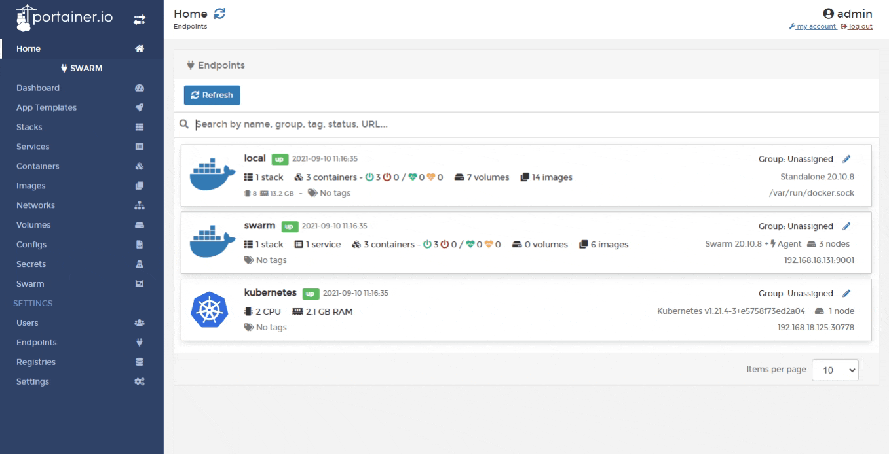
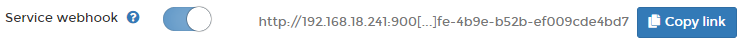

# Webhooks

A webhook is a POST request sent to a URL that you define in Docker Hub or another registry. Use webhooks to trigger an action or a service in response to a repository push event.

## Enabling a service webhook

From the menu select **Services** then select the service that you want to configure the webhook for.



In the **Service details** screen toggle the **Service webhook** option on. When the URL appears, click **Copy link**. This URL will be used to configure the webhook in your chosen registry.



This example shows how to trigger the webhook using `redeploy`:

```text
<form action="http://192.168.1.12:9000/api/webhooks/638e6967-ef77-4906-8af8-236800621360" method="post">
  Redeploy with latest image of same tag <input type="submit" />
</form>
```

This example shows how to trigger the webhook using `update service image with a different tag`:

```text
<form action="http://192.168.1.12:9000/api/webhooks/638e6967-ef77-4906-8af8-236800621360?tag=latest" method="post">
  Update Service image with different tag <input type="submit" />
</form>
```

## Configuring the webhook in Docker Hub

To finish the configuration, refer to [Docker's own documentation](https://docs.docker.com/docker-hub/webhooks/).

