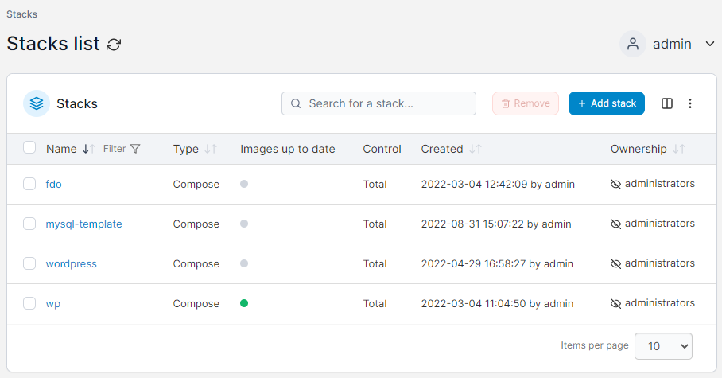

# Stacks

A stack is a collection of services, usually related to one application or usage. For example, a WordPress stack definition may include a web server container (such as nginx) and a database container (such as MySQL).

<figure><figcaption></figcaption></figure>

When the [new image notification](../host/setup.md#other) feature is enabled, the **Images up to date** column indicates whether the local images in the stack are up to date, with a green circle indicating they are up to date and a red circle indicating that there is a newer version of an image available at the remote registry. A grey circle indicates Portainer was unable to determine whether there is an update available for the images.

For more on how this works, have a look at [this knowledge base article](https://portal.portainer.io/knowledge/how-does-the-image-update-notification-icon-work).


[add.md](add.md)



[edit.md](edit.md)



[template.md](template.md)



[webhooks.md](webhooks.md)



[migrate.md](migrate.md)



[remove.md](remove.md)

