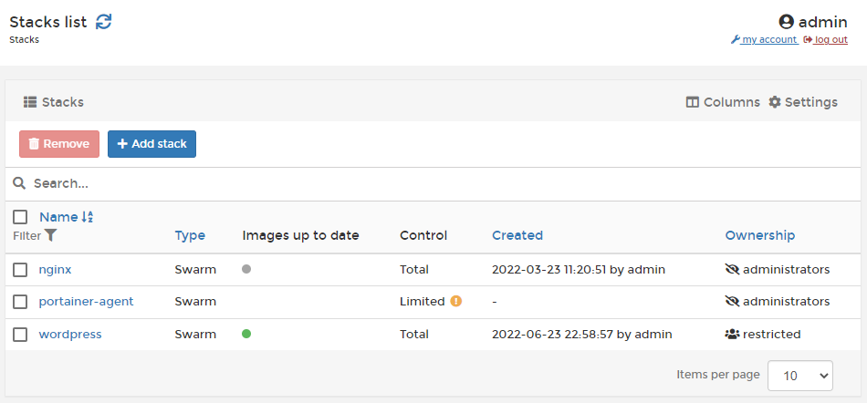

# Stacks

A stack is a collection of services, usually related to one application or usage. For example, a WordPress stack definition may include a web server container (such as nginx) and a database container (such as MySQL).


[add.md](add.md)



[edit.md](edit.md)



[template.md](template.md)



[webhooks.md](webhooks.md)



[migrate.md](migrate.md)



[remove.md](remove.md)

