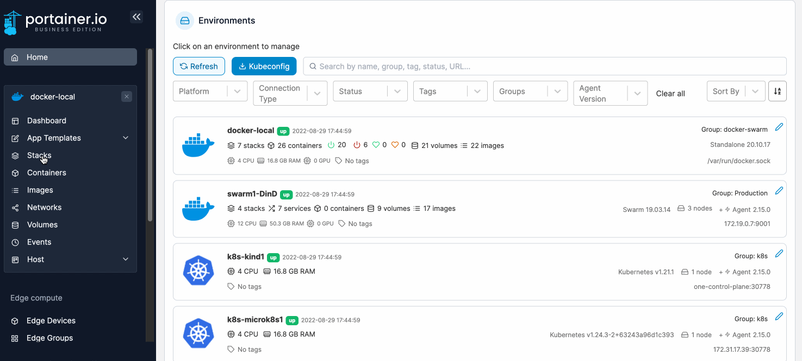
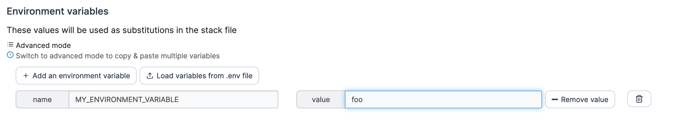
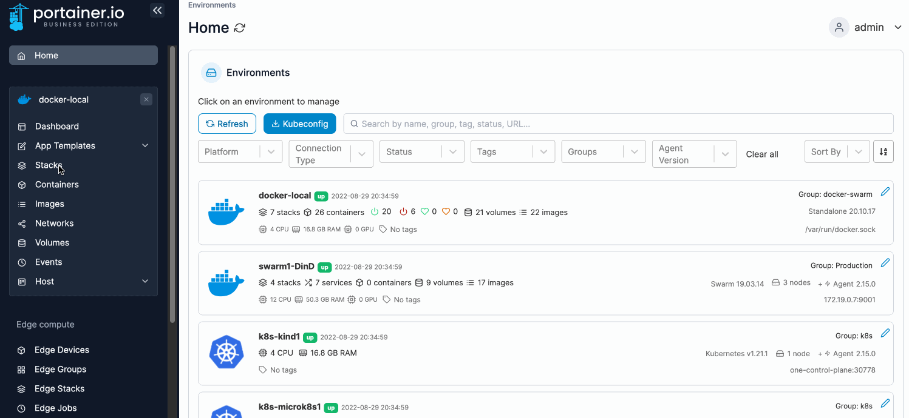
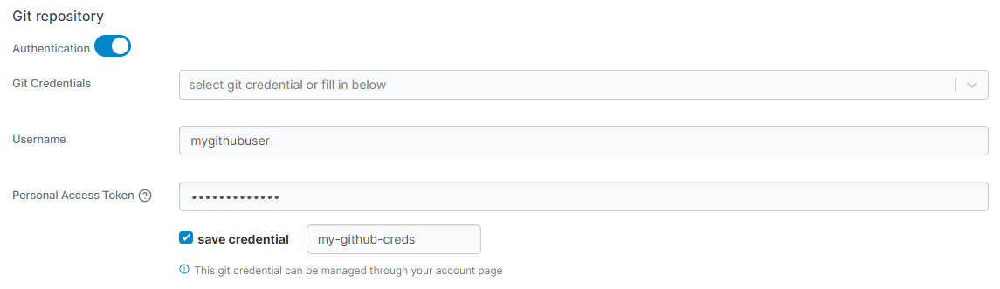
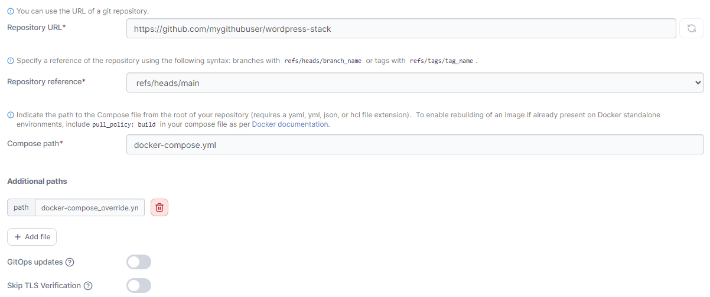
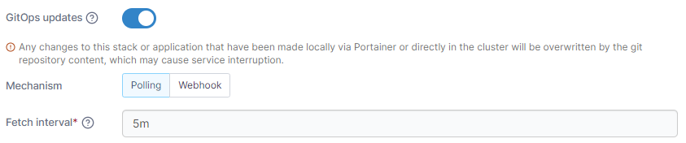
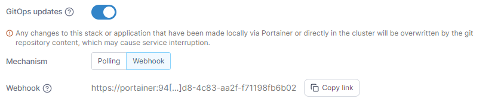
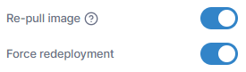
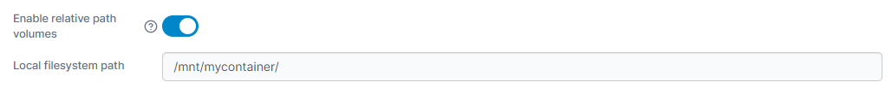

# Add a new stack



## Options when deploying a new stack

There are four ways to deploy a new stack from Portainer:

| Option                                           | Overview                                                                                                 |
| ------------------------------------------------ | -------------------------------------------------------------------------------------------------------- |
| [Web editor](add.md#option-1-web-editor)         | Use our web editor to define the services for the stack using a docker-compose format.                   |
| [Upload](add.md#option-2-upload)                 | If you have a `stack.yml` file, you can upload it from your computer and use it to deploy the stack.     |
| [Git repository](add.md#option-3-git-repository) | You can use a docker-compose format file hosted in a Git repository.                                     |
| Custom template                                  | If you have created a [custom stack template](../templates/custom.md), you can deploy using this option. |

## Option 1: Web editor

From the menu select **Stacks**, click **Add stack**, give the stack a descriptive name then select **Web editor**. Use the web editor to define the services.

<figure><figcaption></figcaption></figure>


You can search within the web editor at any time by pressing `Ctrl-F` (or `Cmd-F` on Mac).


As part of the stack creation you can enable a stack webhook, allowing you to remotely trigger redeployments of the stack from your repository, for example. You can read more on this in our documentation on [stack webhooks](webhooks.md).

<figure><figcaption></figcaption></figure>

As an optional step, you can also use the web editor to define environment variables. You can use these to define values in your compose file that would vary between deployments (for example, hostnames, database names, etc).

Environment variables can be set individually within Portainer or you can use **Load variables from .env file** to upload a file containing your environment variables. Environment variables you define (either individually or via a .env file) will be available to use in your compose file using an `environment` definition:

```
environment:
  MY_ENVIRONMENT_VARIABLE: ${MY_ENVIRONMENT_VARIABLE}
```

Alternatively, on Docker Standalone environments you can add `stack.env` as an `env_file` definition to add all the environment variables that you have defined individually as well as those included in an uploaded .env file:

```
env_file:
  - stack.env
```

**Note:** Using `env_file` to define a file does not work in Docker Swarm due to the lack of `env_file` support in `docker stack deploy` (used on Swarm environments to deploy your stack). On Docker Swarm, you will need to define each environment variable manually.


Note the compose file is not changed when environment variables are used - this allows variables to be updated within Portainer without editing the compose file itself. You will still see the `${MY_ENVIRONMENT_VARIABLE}` style entry in the compose file.


<figure><figcaption></figcaption></figure>

When you're ready, click **Deploy the stack**.

## Option 2: Upload

In Portainer you can create stacks from Compose YML files. To do this, from the menu select **Stacks**, click **Add stack**, then give the stack a descriptive name.

<figure><figcaption></figcaption></figure>

Select **Upload** then select the Compose file from your computer.

As part of the stack creation you can enable a stack webhook, allowing you to remotely trigger redeployments of the stack from your repository, for example. You can read more on this in our documentation on [stack webhooks](webhooks.md).

<figure><figcaption></figcaption></figure>

As an optional step, enter any environment variables. You can use these to define values in your compose file that would vary between deployments (for example, hostnames, database names, etc).

Environment variables can be set individually within Portainer or you can use **Load variables from .env file** to upload a file containing your environment variables. Environment variables you define (either individually or via a .env file) will be available to use in your compose file using an `environment` definition:

```
environment:
  MY_ENVIRONMENT_VARIABLE: ${MY_ENVIRONMENT_VARIABLE}
```

Alternatively, you can add `stack.env` as an `env_file` definition to add all the environment variables that you have defined individually as well as those included in an uploaded .env file:

```
env_file:
  - stack.env
```


Note the compose file is not changed when environment variables are used - this allows variables to be updated within Portainer without editing the compose file itself which would take it out of sync with your local copy. You will still see the `${MY_ENVIRONMENT_VARIABLE}` style entry in the compose file.


<figure><figcaption></figcaption></figure>

When you're ready click **Deploy the stack**.

## Option 3: Git repository

If your Compose file is hosted in a Git repository, you can deploy from there. From the menu select **Stacks**, click **Add stack**, then give the stack a descriptive name.


When a stack is deployed from Git, Portainer will clone the entire Git repository as part of the deployment process. Ensure you have enough free space to accommodate this.



Portainer's Git deployment functionality does not currently support the use of Git submodules. If your repository includes submodules, they will not be pulled as part of the deployment. We [hope to add support](https://github.com/orgs/portainer/discussions/9767) for submodules in a future release.


<figure><figcaption></figcaption></figure>

Select **Git Repository** then enter information about your Git repo.


Any Git-compatible repository should work here. Substitute the details as required.


| Field/Option          | Overview                                                                                                                                                                  |
| --------------------- | ------------------------------------------------------------------------------------------------------------------------------------------------------------------------- |
| Authentication        | Toggle this on if your Git repository requires authentication.                                                                                                            |
| Git Credentials       | If the **Authentication** toggle is enabled and you have [configured Git credentials](../../account-settings.md#git-credentials), you can select them from this dropdown. |
| Username              | Enter your Git username.                                                                                                                                                  |
| Personal Access Token | Enter your personal access token or password.                                                                                                                             |
| Save credential       | Check this option to save the credentials entered above for future use under the name provided in the **credential name** field.                                          |


If you have 2FA configured in GitHub, your passcode is your password.


<figure><figcaption></figcaption></figure>

| Field/Option          | Overview                                                                                                                                                                                          |
| --------------------- | ------------------------------------------------------------------------------------------------------------------------------------------------------------------------------------------------- |
| Repository URL        | Enter the repository URL. If you have enabled Authentication above the credentials will be used to access the repository. The below options will be populated by what is found in the repository. |
| Repository reference  | Select the reference to use when deploying the stack (for example, the branch).                                                                                                                   |
| Compose path          | Enter the path to the Compose file from the root of the repository.                                                                                                                               |
| Additional paths      | Click **Add file** to add additional files to be parsed by the build (for example, an environment-specific compose file).                                                                         |
| GitOps updates        | Toggle this on to enable GitOps updates (see below).                                                                                                                                              |
| Skip TLS verification | Toggle this on to skip the verification of TLS certificates used by your repository. This is useful if your repo uses a self-signed certificate.                                                  |

<figure><figcaption></figcaption></figure>

### GitOps updates

Portainer supports automatically updating your stacks deployed from Git repositories. To enable this, toggle on **GitOps updates** and configure your settings.


For more detail on how GitOps updates function under the hood, have a look at [this knowledge base article](https://portal.portainer.io/knowledge/how-do-automatic-updates-for-stacks-applications-work).


| Field/Option   | Overview                                                                                                                                                                                                                                                                            |
| -------------- | ----------------------------------------------------------------------------------------------------------------------------------------------------------------------------------------------------------------------------------------------------------------------------------- |
| Mechanism      | Select the method to use when checking for updates:                                                                                                                                                                                                                                 |
|                | <p><strong>Polling:</strong> Periodically poll the Git repository from Portainer to check for updates to the repository.</p><p><strong>Webhook:</strong> Generate a webhook URL to add to your Git repository to trigger the update on demand (for example via GitHub actions).</p> |
| Fetch interval | If **Polling** is selected, how often Portainer will check the Git repository for updates.                                                                                                                                                                                          |
| Webhook        | When **Webhook** is selected, displays the webhook URL to use in your integration. Click **Copy link** to copy the webhook URL to the clipboard.                                                                                                                                    |

<figure><figcaption><p>Automatic updates when using polling</p></figcaption></figure>

<figure><figcaption><p>Automatic updates when using webhooks</p></figcaption></figure>

| Field/Option       | Overview                                                                                                                                                                                                                                                                                                                                                                                                                                                                                                                                                    |
| ------------------ | ----------------------------------------------------------------------------------------------------------------------------------------------------------------------------------------------------------------------------------------------------------------------------------------------------------------------------------------------------------------------------------------------------------------------------------------------------------------------------------------------------------------------------------------------------------- |
| Re-pull image      | <p>Enable this setting to always pull the most recent version of container images when updating the stack. This is equivalent to the <code>--pull=always</code> flag for <code>docker run</code>.<br>This option was previously labeled as <strong>Pull latest image</strong>.</p>                                                                                                                                                                                                                                                                          |
| Force redeployment | <p>Enable this setting to force the redeployment of your stack at the specified interval (or when the webhook is triggered), overwriting any changes that have been made in the local environment, even if there has been no update to the stack in Git. This is useful if you want to ensure that your Git repository is the source of truth for your stacks and are happy with the local stack being replaced.</p><p>If this option is left disabled, automatic updates will only trigger if Portainer detects a change in the remote Git repository.</p> |

<figure><figcaption></figcaption></figure>

### Relative path volumes

When you toggle **Enable relative path volumes** to on, you are able to specify relative path references in your compose files. Portainer will create the required directory structure and populate the directories with the relevant files from your Git repository.


This feature is only available in Portainer Business Edition.


On Docker Standalone environments, specify the path at which you want your files to be created on your host filesystem in the **Local filesystem path** field.


Ensure this directory exists on your local filesystem and is writable.


<figure><figcaption></figcaption></figure>

On Docker Swarm environments, specify the path at which you want your files to be created in the Network filesystem path field.


Ensure that this path is available on all of your Docker Swarm nodes and is writable.


<figure><figcaption></figcaption></figure>


For more detail on how this feature works, have a look at [this article](../../../advanced/relative-paths.md).


### Environment variables

As an optional step, you can also set environment variables. You can use these to define values in your compose file that would vary between deployments (for example, hostnames, database names, etc).

Environment variables can be set individually within Portainer or you can use **Load variables from .env file** to upload a file containing your environment variables. Environment variables you define (either individually or via a .env file) will be available to use in your compose file using an `environment` definition:

```
environment:
  MY_ENVIRONMENT_VARIABLE: ${MY_ENVIRONMENT_VARIABLE}
```

Alternatively, you can add `stack.env` as an `env_file` definition to add all the environment variables that you have defined individually as well as those included in an uploaded .env file:

```
env_file:
  - stack.env
```


Note the compose file is not changed when environment variables are used - this allows variables to be updated within Portainer without editing the compose file itself which would take it out of sync with the Git repository. You will still see the `${MY_ENVIRONMENT_VARIABLE}` style entry in the compose file.


<figure><figcaption></figcaption></figure>

Enter environment variables if required then click **Deploy the stack**.
