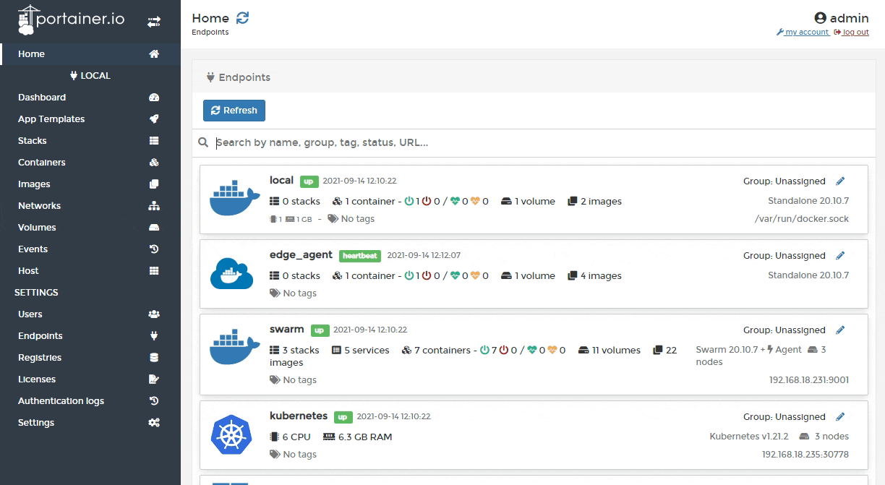
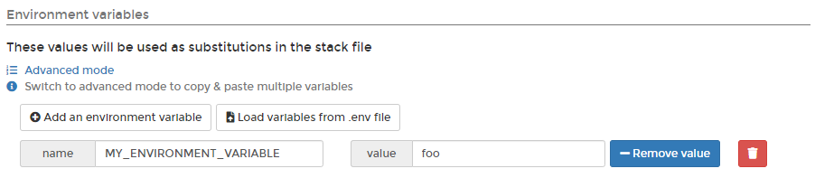
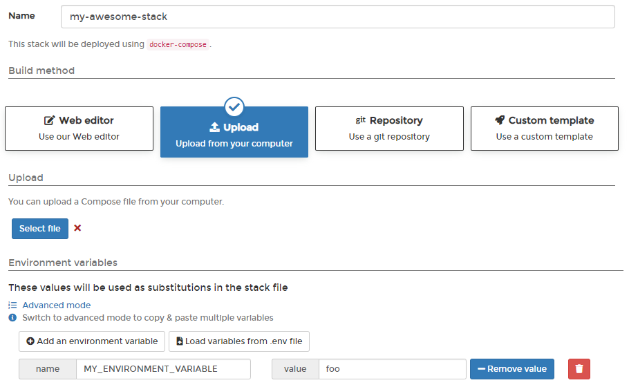
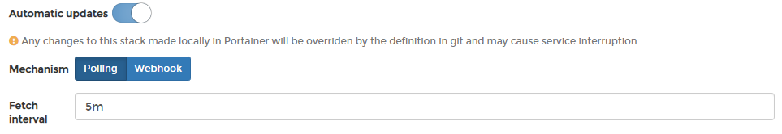
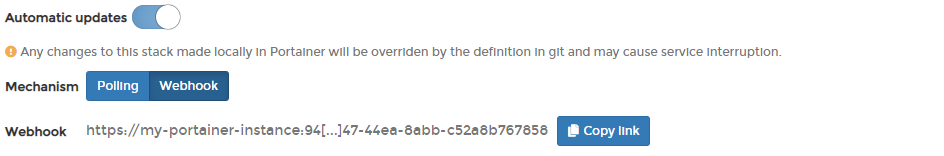

# Add a new stack

## Options when deploying a new stack

There are four ways to deploy a new stack from Portainer:

| Option          | Overview                                                                                                 |
| --------------- | -------------------------------------------------------------------------------------------------------- |
| Web editor      | Use our web editor to define the services for the stack using a docker-compose format.                   |
| Upload          | If you have a `stack.yml` file, you can upload it from your computer and use it to deploy the stack.     |
| Git Repository  | You can use a docker-compose format file hosted in a Git repository.                                     |
| Custom template | If you have created a [custom stack template](../templates/custom.md), you can deploy using this option. |

## Option 1: Web editor

From the menu select **Stacks**, click **Add stack**, give the stack a descriptive name then select **Web editor**. Use the web editor to define the services.



As an optional step, you can also use the web editor to define environment variables. You can use these to define values in your compose file that would vary between deployments (for example, hostnames, database names, etc).

Environment variables can be set individually within Portainer or you can use **Load variables from .env file** to upload a file containing your environment variables. Environment variables you define (either individually or via a .env file) will be available to use in your compose file using an `environment` definition:

```
environment:
  - MY_ENVIRONMENT_VARIABLE: ${MY_ENVIRONMENT_VARIABLE}
```

Alternatively, you can add `stack.env` as an `env_file` definition to add all the environment variables that you have defined individually as well as those included in an uploaded .env file:

```
env_file:
  - stack.env
```


Note the compose file is not changed when environment variables are used - this allows variables to be updated within Portainer without editing the compose file itself. You will still see the `${MY_ENVIRONMENT_VARIABLE}` style entry in the compose file.




When you're ready, click **Deploy the stack**.

## Option 2: Upload

In Portainer you can create stacks from Compose YML files. To do this, from the menu select **Stacks**, click **Add stack**, then give the stack a descriptive name.


Select **Upload** then select the Compose file from your computer. As an optional step, enter any environment variables. You can use these to define values in your compose file that would vary between deployments (for example, hostnames, database names, etc).

Environment variables can be set individually within Portainer or you can use **Load variables from .env file** to upload a file containing your environment variables. Environment variables you define (either individually or via a .env file) will be available to use in your compose file using an `environment` definition:

```
environment:
  - MY_ENVIRONMENT_VARIABLE: ${MY_ENVIRONMENT_VARIABLE}
```

Alternatively, you can add `stack.env` as an `env_file` definition to add all the environment variables that you have defined individually as well as those included in an uploaded .env file:

```
env_file:
  - stack.env
```


Note the compose file is not changed when environment variables are used - this allows variables to be updated within Portainer without editing the compose file itself which would take it out of sync with your local copy. You will still see the `${MY_ENVIRONMENT_VARIABLE}` style entry in the compose file.




When you're ready click **Deploy the stack**.

## Option 3: Git repository

If your Compose file is hosted in a Git repository, you can deploy from there. From the menu select **Stacks**, click **Add stack**, then give the stack a descriptive name.


Select **Git Repository** then enter information about your Git repo.


Any Git-compatible repository should work here. Substitute the details as required.


| Field/Option          | Overview                                                                                                                                                                                        |
| --------------------- | ----------------------------------------------------------------------------------------------------------------------------------------------------------------------------------------------- |
| Repository URL        | Enter the repository URL.                                                                                                                                                                       |
| Repository Reference  | Enter the branch.                                                                                                                                                                               |
| Compose Path          | This is the path to the Compose file from the root of the repository. Click **add file** to add additional files to be parsed by the build (for example, an environment-specific compose file). |
| Authentication        | Toggle this on if your Git repository requires authentication.                                                                                                                                  |
| Username              | Enter your Git username.                                                                                                                                                                        |
| Personal Access Token | Enter your personal access token or password.                                                                                                                                                   |


If you have 2FA configured in GitHub, your passcode is your password.



### Automatic updates

New in version 2.10 is the ability to automatically update your stack deployed from Git. To enable this, toggle on **Automatic updates** and configure your settings.


For more detail on how automatic updates function under the hood, have a look at [this FAQ entry](../../../faq/troubleshooting/how-do-automatic-updates-for-stacks-applications-work.md).


| **Field/Option** | **Overview**                                                                                                                                                                                                                                                                        |
| ---------------- | ----------------------------------------------------------------------------------------------------------------------------------------------------------------------------------------------------------------------------------------------------------------------------------- |
| Mechanism        | Select the method to use when checking for updates:                                                                                                                                                                                                                                 |
|                  | <p><strong>Polling:</strong> Periodically poll the Git repository from Portainer to check for updates to the repository.</p><p><strong>Webhook:</strong> Generate a webhook URL to add to your Git repository to trigger the update on demand (for example via GitHub actions).</p> |
| Fetch interval   | If **Polling** is selected, how often Portainer will check the Git repository for updates.                                                                                                                                                                                          |
| Webhook          | When **Webhook** is selected, displays the webhook URL to use in your integration. Click **Copy link** to copy the webhook URL to the clipboard.                                                                                                                                    |





| Field/Option       | Overview                                                                                                                                                                                                                                                                                                                                                                                                                                                                                                                                                           |
| ------------------ | ------------------------------------------------------------------------------------------------------------------------------------------------------------------------------------------------------------------------------------------------------------------------------------------------------------------------------------------------------------------------------------------------------------------------------------------------------------------------------------------------------------------------------------------------------------------ |
| Force Redeployment | <p>Enable this setting to force the redeployment of your stack at the specified interval (or when the webhook is triggered), overwriting any changes that have been made in the local environment, even if there has been no update to the stack in Git. This is useful if you want to ensure that your Git repository is the source of truth for your stacks and are happy with the local stack being replaced.</p><p></p><p>If this option is left disabled, automatic updates will only trigger if Portainer detects a change in the remote Git repository.</p> |


As an optional step, you can also set environment variables. You can use these to define values in your compose file that would vary between deployments (for example, hostnames, database names, etc).

Environment variables can be set individually within Portainer or you can use **Load variables from .env file** to upload a file containing your environment variables. Environment variables you define (either individually or via a .env file) will be available to use in your compose file using an `environment` definition:

```
environment:
  - MY_ENVIRONMENT_VARIABLE: ${MY_ENVIRONMENT_VARIABLE}
```

Alternatively, you can add `stack.env` as an `env_file` definition to add all the environment variables that you have defined individually as well as those included in an uploaded .env file:

```
env_file:
  - stack.env
```


Note the compose file is not changed when environment variables are used - this allows variables to be updated within Portainer without editing the compose file itself which would take it out of sync with the Git repository. You will still see the `${MY_ENVIRONMENT_VARIABLE}` style entry in the compose file.



Enter environment variables if required then click **Deploy the stack**.
