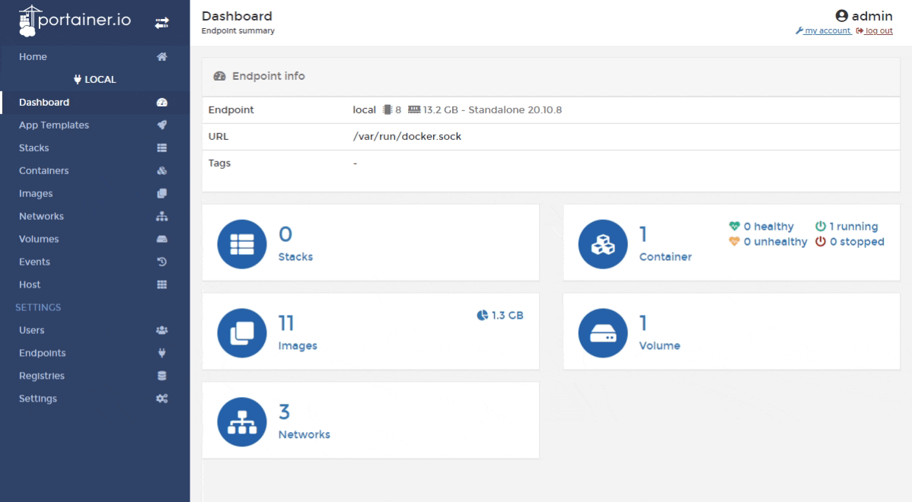
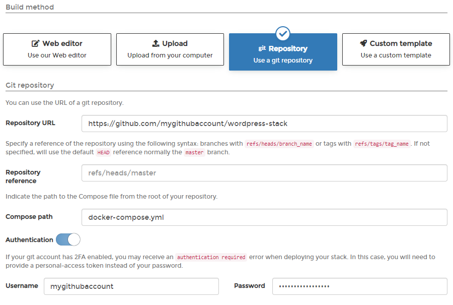

# Add a new stack

## Options when deploying a new stack

There are four ways to deploy a new stack from Portainer:

| Option | Overview |
| :--- | :--- |
| Web editor | Use our web editor to define the services for the stack using a docker-compose format. |
| Upload | If you have a `stack.yml` file, you can upload it from your computer and use it to deploy the stack. |
| Git Repository | You can use a docker-compose format file hosted in GitHub. |
| Custom template | If you have already created a template of stacks, you can deploy using this option. |

## Option 1: Web editor

From the menu select **Stacks**, click **Add stack**, give the stack a descriptive name then select **Web editor**. Use the web editor to define the services.

As an optional step, you can also use the web editor to define environment variables.

When you're ready, click **Deploy the stack**.

## Option 2: Upload

In Portainer you can create stacks from Compose YML files. To do this, from the menu select **Stacks**, click **Add stack**, then give the stack a descriptive name.

Select **Upload** then select the Compose file from your computer. As an optional step, enter any environment variables.

When you're ready click **Deploy the stack**.

## Option 3: GitHub

If your Compose file is hosted in GitHub, you can deploy from there. From the menu select **Stacks**, click **Add stack**, then select **Git Repository**.


Any Git-compatible repository should work here. Substitute the details as required.


Give the stack a descriptive name then enter information about your Git repo:

| Field/Option | Overview |
| :--- | :--- |
| Repository URL | Enter the repository URL. |
| Repository Reference | Enter the branch. |
| Compose Path | Enter the path to the Compose file from the root of the repository. |

If you need to authenticate, enter the username and password.


If you have 2FA configured in GitHub, your passcode is your password.


Enter environment variables if required then click **Deploy the stack**.

