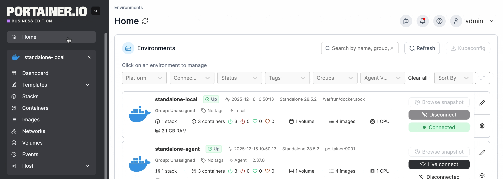
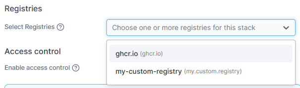
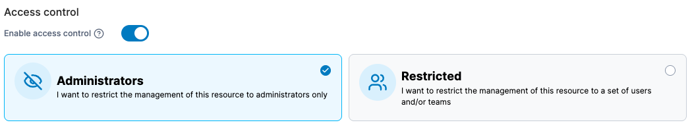
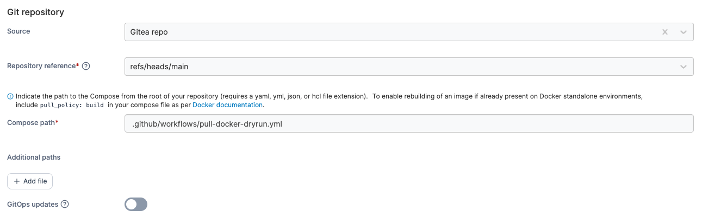
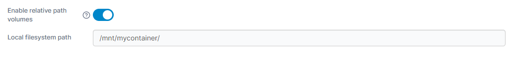

# Add a new stack

From the menu select **Stacks**, then click **Add stack**. Give the stack a descriptive name, then choose a build method:

* **Web editor** - type your compose content directly
* **Upload** - upload a `stack.yml` file
* **Git repository** - [deploy from a hosted Git repository](add.md#deploying-from-a-git-repository)
* **Custom template** - use a pre-defined template

<figure><figcaption></figcaption></figure>

Once the stack content is defined, you can configure [webhooks](add.md#webhooks), [environment variables](add.md#environment-variables), [registries](add.md#registries), and [access control](add.md#access-control) before deploying.

### Webhooks

You can enable a webhook to allow remote triggering of stack redeployments. See [stack webhooks](webhooks.md) for details.

<figure><figcaption></figcaption></figure>

### Environment variables&#x20;

Environment variables let you define values that vary between deployments, such as hostnames or database names. You can set them individually in Portainer, or upload a `.env` file using **Load variables from .env file**.

Variables defined in either way are available in your compose file:

```
environment:
  MY_ENVIRONMENT_VARIABLE: ${MY_ENVIRONMENT_VARIABLE}
```

On Docker Standalone and Podman environments, you can also reference all defined variables via an `env_file` definition:

```
env_file:
  - stack.env
```


**Note:** `env_file` is not supported on Docker Swarm. Define each variable individually instead.



The compose file itself is not modified when environment variables are set - variables can be updated in Portainer without editing the compose file.


<figure><figcaption></figcaption></figure>

### Registries

Select the registries to use when deploying the stack. This is useful when your stack pulls images from multiple registries requiring authentication.


By default, all configured registries are used. If you have multiple registries from the same provider (such as multiple `ghcr.io` registries), explicitly selecting the correct registry ensures the right credentials are used.


<figure><figcaption></figcaption></figure>

### Access control

To restrict management of this stack, enable access control and select one of:

* **Administrators only**
* **Restricted** - specify the users and teams who should have access

<figure><figcaption></figcaption></figure>

When you're ready, click **Deploy the stack**.

## Deploying from a Git repository

If your compose file is hosted in a Git repository, you can deploy directly from it. See the details below on setting up your Git repository.&#x20;

| Field/Option         | Overview                                                                                                                                                                                                                                                                             |
| -------------------- | ------------------------------------------------------------------------------------------------------------------------------------------------------------------------------------------------------------------------------------------------------------------------------------ |
| Source               | Select your Git repository from your list of preconfigured [sources](../../app-delivery/sources/).                                                                                                                                                                                   |
| Repository reference | Select the reference to use when deploying the stack (for example, the branch).                                                                                                                                                                                                      |
| Compose path         | Enter the path to the Compose file from the root of the repository.                                                                                                                                                                                                                  |
| Additional paths     | Click **Add file** to add additional YAML files to be parsed by the build. This is the equivalent of passing multiple `-f` options to `docker compose`, and abides by the same [merging rules](https://docs.docker.com/compose/how-tos/multiple-compose-files/merge/#merging-rules). |
| GitOps updates       | Toggle this on to enable GitOps updates (see below).                                                                                                                                                                                                                                 |

<figure><figcaption></figcaption></figure>

### GitOps updates

To keep your stack automatically in sync with your repository, toggle on **GitOps updates** and configure your settings.&#x20;


See [this article](../../../faqs/troubleshooting/stacks-deployments-and-updates/how-do-automatic-updates-for-stacks-applications-work.md) for details on how GitOps updates work


| Field/Option   | Overview                                                                                                                                                                                                                                                                                                                                   |
| -------------- | ------------------------------------------------------------------------------------------------------------------------------------------------------------------------------------------------------------------------------------------------------------------------------------------------------------------------------------------ |
| Mechanism      | <p>Select the method to use when checking for updates:<br><strong>Polling:</strong> Periodically poll the Git repository from Portainer to check for updates to the repository.</p><p><strong>Webhook:</strong> Generate a webhook URL to add to your Git repository to trigger the update on demand (for example via GitHub actions).</p> |
| Fetch interval | If **Polling** is selected, define how often Portainer will check the Git repository for updates.                                                                                                                                                                                                                                          |
| Webhook        | When **Webhook** is selected, this field displays the webhook URL to use in your integration. Click **Copy link** to copy the webhook URL to the clipboard.                                                                                                                                                                                |

<figure><figcaption><p>Automatic updates when using polling</p></figcaption></figure>

<figure><figcaption><p>Automatic updates when using webhooks</p></figcaption></figure>

| Field/Option       | Overview                                                                                                                                                                                                                                                                                                                                                                                                                                                                                                                                                    |
| ------------------ | ----------------------------------------------------------------------------------------------------------------------------------------------------------------------------------------------------------------------------------------------------------------------------------------------------------------------------------------------------------------------------------------------------------------------------------------------------------------------------------------------------------------------------------------------------------- |
| Re-pull image      | <p>Enable this setting to always pull the most recent version of container images when updating the stack. This is equivalent to the <code>--pull=always</code> flag for <code>docker run</code>.<br>This option was previously labeled as <strong>Pull latest image</strong>.</p>                                                                                                                                                                                                                                                                          |
| Force redeployment | <p>Enable this setting to force the redeployment of your stack at the specified interval (or when the webhook is triggered), overwriting any changes that have been made in the local environment, even if there has been no update to the stack in Git. This is useful if you want to ensure that your Git repository is the source of truth for your stacks and are happy with the local stack being replaced.</p><p>If this option is left disabled, automatic updates will only trigger if Portainer detects a change in the remote Git repository.</p> |

<figure><figcaption></figcaption></figure>

### Relative path volumes


Enabling relative path volumes is available in Business Edition only.


Toggle on **Enable relative path volumes** to use relative path references in your compose files. Portainer will create the required directory structure and populate it with files from your Git repository.

* **Docker Standalone / Podman** - specify the path in the **Local filesystem path** field. The directory must exist on your host filesystem and be writable.
* **Docker Swarm** - specify the path in the **Network filesystem path** field. The path must be available and writable across all Swarm nodes.

See [this article](../../../advanced/relative-paths.md) for more detail on how relative path volumes work.

<figure><figcaption></figcaption></figure>
