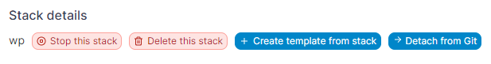
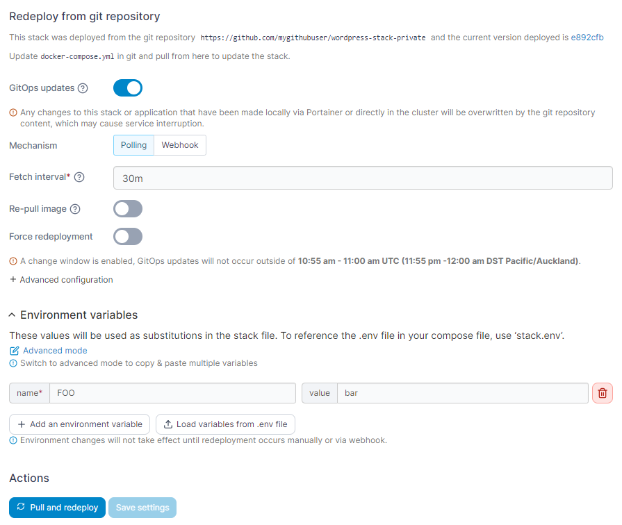
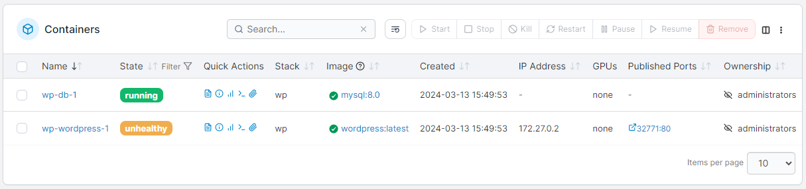
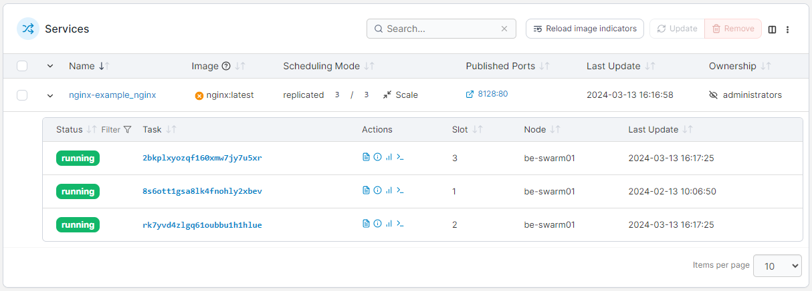
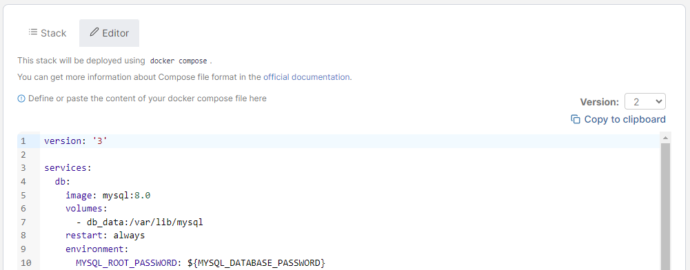
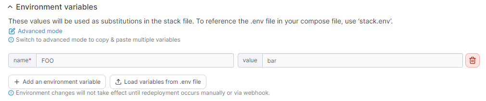
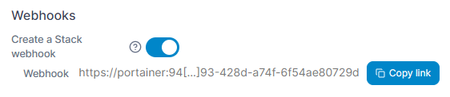

# Inspect or edit a stack

## Inspecting a stack

From the menu select **Stacks** then select the stack you want to inspect.

<figure><figcaption></figcaption></figure>

From here you can stop, delete or [create a template from the stack](template.md), and if deployed from Git you can [detach the stack from the Git repository](edit.md#detach-from-git).

<figure><figcaption></figcaption></figure>

If the stack was deployed from a Git repository, you can:

* Configure [GitOps updates](add.md#gitops-updates) or manually pull and redeploy the stack.
* View and edit the stack's environment variables.

<figure><figcaption></figcaption></figure>

If the stack was deployed using the [Web Editor](add.md#option-1-web-editor) or [uploaded](add.md#option-2-upload), you will have the option to [edit your compose file manually](edit.md#editing-a-stack).

Regardless of the deployment method used, you can also [migrate or duplicate](migrate.md) the stack.

### Docker Standalone

When using Docker Standalone, you can:

* View the containers that make up the stack.
* Check to see if they are running or stopped.
* Get access to logs.
* Inspect individual containers.
* View container statistics.
* Get access to the container's console.

You can also see the image update indicator for each container in the stack. To recheck the image update status for all containers in the stack you can click the reload button next to the search box, or to recheck a single container's image, click the image update indicator icon for that container.&#x20;

<figure><figcaption></figcaption></figure>

### Docker Swarm

When using Docker Swarm, you can:

* View the services that make up the stack, and the individual tasks that make up each service.
* Check to see if they are running or stopped.
* See how many replicas are running on each host.
* Get access to logs.
* Inspect individual services.
* View service statistics.
* Get access to the service's console.

You can also see the image update indicator for each service in the stack. To recheck the image update status for all services in the stack you can click the Reload image indicators button, or to recheck a single service's image, click the image update indicator icon for that service.&#x20;

<figure><figcaption></figcaption></figure>

## Editing a stack

Editing a stack allows you to make changes to the configuration and redeploy those changes. To edit a stack, from the menu select **Stacks**, select the stack you want to edit, then select the **Editor** tab.


The Editor tab is only available for stacks that were deployed using the [Web Editor](add.md#option-1-web-editor). For stacks deployed from a Git repository, the compose file must be edited in the repository itself.


<figure><figcaption></figcaption></figure>

Here, you can edit the Compose file for the stack to suit your needs. Using the **Version** dropdown you can also select a previous version of your stack file (if one exists) to switch back to if required. Selecting a different version from the dropdown will replace the contents of the editor with that of the selected version.&#x20;


You can search within the web editor at any time by pressing `Ctrl-F` (or `Cmd-F` on Mac).


In this section you can expand the Environment variables section to view and make changes to the stack's environment variables.

<figure><figcaption></figcaption></figure>

You can also toggle the stack [webhook](webhooks.md) and retrieve the webhook URL:&#x20;

<figure><figcaption></figcaption></figure>

On Docker Swarm environments you can **Prune services** if you have made changes that remove some services from the stack.

<figure><figcaption></figcaption></figure>

When you have finished making changes, click **Update the stack**.

## Detach from Git

If your stack was created from a Git repository, you have the option to detach the stack from the repository. This means you can [edit the stack directly within Portainer](edit.md#editing-a-stack), but it does mean that the stack can't be updated from Git anymore. This action also cannot be reversed.


Detaching downloads the main compose file for the stack and stores it in Portainer. It does not download any additional compose files or `.env` files that may be contained within the repository.


Click **Detach from Git** to detach. You will be asked to confirm the action - click **Detach** to do so.
