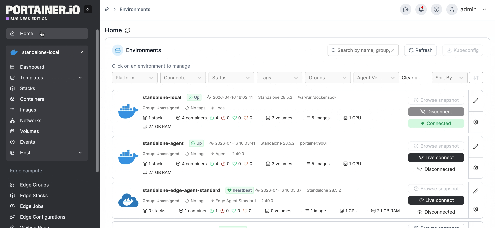
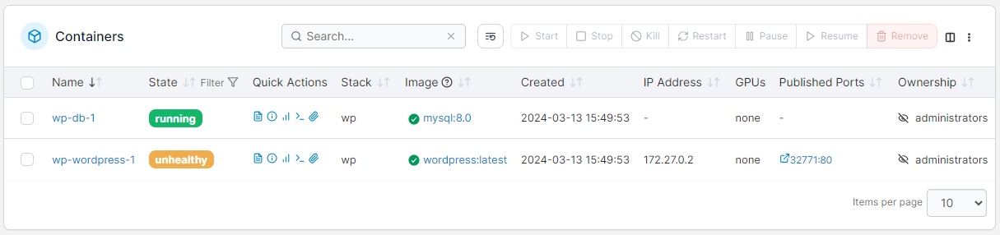
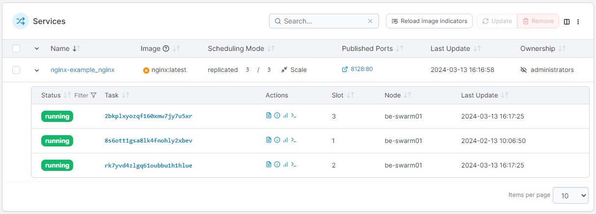
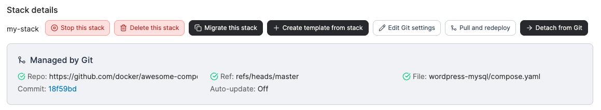
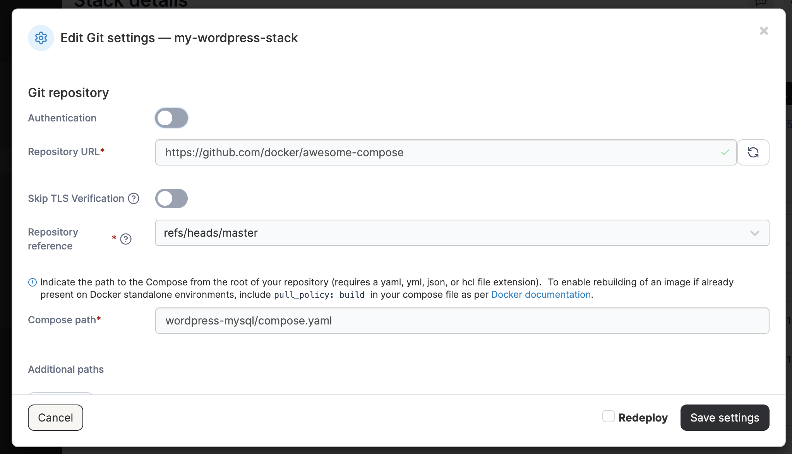
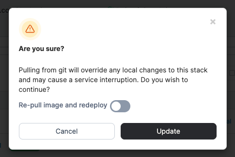
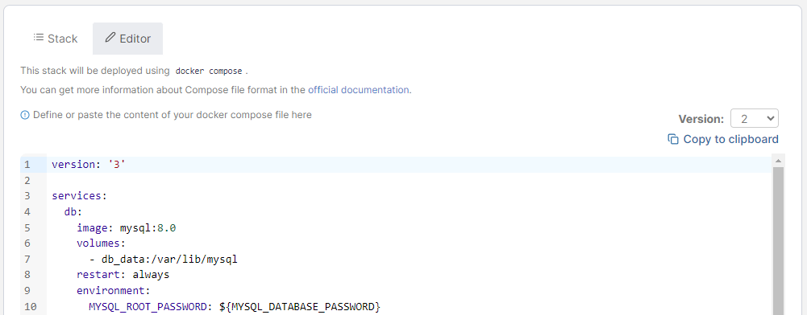
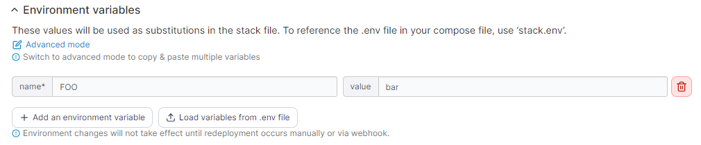
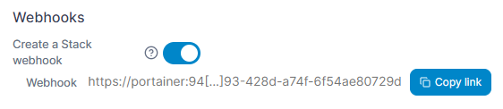
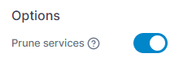

---
metaLinks:
  alternates:
    - https://app.gitbook.com/s/MdgxA76kWxcRmwybM8Ft/user/docker/stacks/edit
---

# Inspect or edit a stack

From the menu select **Stacks** then select the stack you want to inspect or edit.

<figure><figcaption></figcaption></figure>

From the **Stack details** section at the top of the page, you can stop, delete, [migrate the stack](migrate.md) or [create a template from the stack](template.md). If the stack is deployed from Git you can [edit the Git settings](edit.md#edit-git-settings), [Pull and redeploy](edit.md#pull-and-redeploy) and [detach the stack from the Git repository](edit.md#detach-from-git) directly from this stack details view.

## Inspect a stack

### Docker Standalone / Podman

When using Docker Standalone or Podman, you can:

* View the containers that make up the stack.
* Check to see if they are running or stopped.
* Get access to logs.
* Inspect individual containers.
* View container statistics.
* Get access to the container's console.

You can also see the image update indicator for each container in the stack. To recheck the image update status for all containers in the stack you can click the reload button next to the search box, or to recheck a single container's image, click the image update indicator icon for that container.&#x20;

<figure><figcaption></figcaption></figure>

### Docker Swarm

When using Docker Swarm, you can:

* View the services that make up the stack, and the individual tasks that make up each service.
* Check to see if they are running or stopped.
* See how many replicas are running on each host.
* Get access to logs.
* Inspect individual services.
* View service statistics.
* Get access to the service's console.

You can also see the image update indicator for each service in the stack. To recheck the image update status for all services in the stack you can click the Reload image indicators button, or to recheck a single service's image, click the image update indicator icon for that service.&#x20;

<figure><figcaption></figcaption></figure>

## Edit a stack

### Edit a stack deployed from Git

<figure><figcaption></figcaption></figure>

#### Edit Git settings

If the stack was deployed from a Git repository, you can select **Edit Git settings**, allowing you to:

* Edit the [Git repository details](add.md#option-3-git-repository).
* Configure [GitOps updates](add.md#gitops-updates) or manually pull and redeploy the stack.
* View and edit the stack's environment variables.

Check **Redeploy** if you would like the stack to redeploy on saving. Click **Save settings** when you are done.

<figure><figcaption></figcaption></figure>

#### Pull and redeploy

If the stack was deployed from a Git repository, you can pull the latest commit from the Git repository and redeploy the stack by selecting **Pull and redeploy**.&#x20;

In the resulting dialog box, optionally toggle **Re-pull image and redeploy** to force Docker to pull the latest version of the container images from the registry, even if it already has a copy locally. Select **Update** when you are ready. This may result in service interruption.&#x20;

<figure><figcaption></figcaption></figure>

#### Detach from Git

If your stack was created from a Git repository, you have the option to detach the stack from the repository. This means you can edit the stack directly within Portainer, but it does mean that the stack can't be updated from Git anymore. This action also cannot be reversed.


Detaching downloads the main compose file for the stack and stores it in Portainer. It does not download any additional compose files or `.env` files that may be contained within the repository.


Click **Detach from Git** to detach. You will be asked to confirm the action - click **Detach** to do so.

### Edit a stack deployed using the Web Editor or uploaded

If the stack was deployed using the [Web Editor](add.md#option-1-web-editor) or [uploaded](add.md#option-2-upload), you will have the option to edit your compose file manually, allowing you to make changes to the configuration and redeploy those changes.&#x20;

To edit a stack, from the menu select **Stacks**, select the stack you want to edit, then select the **Editor** tab.


The Editor tab is only available for stacks that were deployed using the [Web Editor](add.md#option-1-web-editor). For stacks deployed from a Git repository, the compose file must be edited in the repository itself.


<figure><figcaption></figcaption></figure>

Here, you can edit the Compose file for the stack to suit your needs. Using the **Version** dropdown you can also select a previous version of your stack file (if one exists) to switch back to if required. Selecting a different version from the dropdown will replace the contents of the editor with that of the selected version.&#x20;


You can search within the web editor at any time by pressing `Ctrl-F` (or `Cmd-F` on Mac).

\
The web editor will visually highlight invisible special characters such as non-breaking spaces, helping you identify hidden characters that may cause unexpected errors in your configuration.


In this section you can expand the Environment variables section to view and make changes to the stack's environment variables.

<figure><figcaption></figcaption></figure>

You can also toggle the stack [webhook](webhooks.md) and retrieve the webhook URL:&#x20;

<figure><figcaption></figcaption></figure>

You can choose to **Prune services** if you have made changes that remove some services from the stack.

<figure><figcaption></figcaption></figure>

When you have finished making changes, click **Update the stack**.
